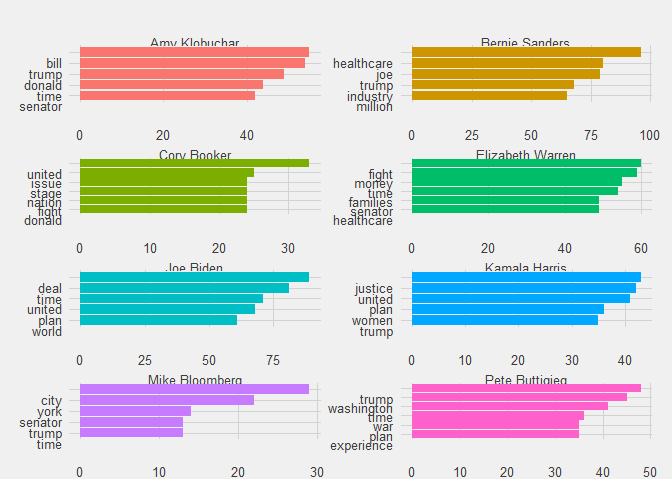

What Did the Democratic Presidential Candidates Talk About?
================
Chad Peltier
6/5/2020

This project is intended to analyze the 2020 Democratic Presidential
candidates’ performances in the eleven debates.

We’ll start off by creating a tibble of the transcripts of the debates,
with a row for each response given by a candidate.

I scraped the transcripts from various sources, because no single source
seemed to have transcripts for every debate. Unfortunately, that meant
that the regex varied by debated, and so creating a function to automate
this process would be much more difficult.

``` r
library(tidyverse)
library(rvest)
library(httr)
library(lubridate)
library(tidytext)
```

``` r
## Debate 1 pt 1 - Miami
html <- read_html("https://www.nytimes.com/2019/06/26/us/politics/democratic-debate-transcript.html")

debate1_1 <- html_nodes(html, ".StoryBodyCompanionColumn")
debate1_1 <- tibble(transcript = html_text(debate1_1, trim = TRUE))

debate1_1 <- debate1_1 %>%
    mutate(debate = 1) %>%
    separate_rows(transcript, sep = "[\\?\\.\\)\\’a-z](?=[A-Z]{2,})") %>%
    separate(transcript, sep = "\\:", into = "speaker", remove = FALSE)
```

    ## Warning: Expected 1 pieces. Additional pieces discarded in 535 rows [2, 3, 4, 5,
    ## 6, 7, 8, 9, 10, 11, 12, 13, 14, 15, 16, 17, 18, 19, 20, 21, ...].

``` r
## Debate 1 pt 2 - Miami
html <- read_html("https://www.nytimes.com/2019/06/28/us/politics/transcript-debate.html")

debate1_2 <- html_nodes(html, ".StoryBodyCompanionColumn")
debate1_2 <- tibble(transcript = html_text(debate1_2, trim = TRUE))

debate1_2 <- debate1_2 %>%
    mutate(debate = 1) %>%
    separate_rows(transcript, sep = "[\\?\\.\\)\\’\\—a-z](?=[A-Z]{2,})") %>%
    separate(transcript, sep = "\\:", into = "speaker", remove = FALSE)
```

    ## Warning: Expected 1 pieces. Additional pieces discarded in 590 rows [2, 3, 4, 5,
    ## 6, 7, 8, 9, 10, 11, 12, 13, 14, 15, 16, 17, 18, 20, 21, 22, ...].

``` r
## Debate 2 pt 1 - Detroit
html <- read_html("https://www.rev.com/blog/transcripts/transcript-of-july-democratic-debate-night-1-full-transcript-july-30-2019")

debate2_1 <- html_nodes(html, "#transcription")
debate2_1 <- tibble(transcript = html_text(debate2_1, trim = TRUE))

debate2_1 <- debate2_1 %>%
    mutate(debate = 2) %>%
    separate_rows(transcript, sep = "[\\.\\?\\]\\’](?=[A-Z\\sa-z]+(W.)?:\\s\\()") %>%
    separate(transcript, sep = "\\:", into = "speaker", remove = FALSE)
```

    ## Warning: Expected 1 pieces. Additional pieces discarded in 523 rows [1, 2, 3, 4,
    ## 5, 6, 7, 8, 9, 10, 11, 12, 13, 14, 15, 16, 17, 18, 19, 20, ...].

``` r
## Debate 2 pt 2 - Detroit
html <- read_html("https://www.rev.com/blog/transcripts/transcript-of-july-democratic-debate-2nd-round-night-2-full-transcript-july-31-2019")

debate2_2 <- html_nodes(html, "#transcription")
debate2_2 <- tibble(transcript = html_text(debate2_2, trim = TRUE))

debate2_2 <- debate2_2 %>%
    mutate(debate = 2) %>%
    separate_rows(transcript, sep = "[\\.\\?\\]\\’](?=[A-Z\\sa-z]+(W.)?:\\s\\()") %>%
    separate(transcript, sep = "\\:", into = "speaker", remove = FALSE)
```

    ## Warning: Expected 1 pieces. Additional pieces discarded in 437 rows [1, 2, 3, 4,
    ## 5, 6, 7, 8, 9, 10, 11, 12, 13, 14, 15, 16, 17, 18, 19, 20, ...].

``` r
## Debate 3 - Houston
html <- read_html("https://www.rev.com/blog/transcripts/democratic-debate-transcript-houston-september-12-2019")

debate3 <- html_nodes(html, "#transcription")
debate3 <- tibble(transcript = html_text(debate3, trim = TRUE))

debate3 <- debate3 %>%
    mutate(debate = 3) %>%
    separate_rows(transcript, sep = "[\\.\\?\\’](?=[A-Z\\sa-z\\’]+:)") %>%
    separate_rows(transcript, sep = "[\\.\\?\\]](?=George S.:)") %>%
    separate(transcript, sep = "\\:", into = "speaker", remove = FALSE) %>%
    filter(transcript != "Beto O")
```

    ## Warning: Expected 1 pieces. Additional pieces discarded in 410 rows [1, 2, 3, 4,
    ## 5, 6, 7, 8, 10, 11, 12, 13, 14, 15, 16, 17, 18, 19, 20, 21, ...].

``` r
## Debate 4 - Ohio
html <- read_html("https://www.rev.com/blog/transcripts/october-democratic-debate-transcript-4th-debate-from-ohio")

debate4 <- html_nodes(html, "#transcription")
debate4 <- tibble(transcript = html_text(debate4, trim = TRUE))

debate4 <- debate4 %>%
    mutate(debate = 4) %>%
    separate_rows(transcript, sep = "[\\.\\?\\’\\-](?=[A-Z\\sa-z]+:)") %>%
    separate(transcript, sep = "\\:", into = "speaker", remove = FALSE) 
```

    ## Warning: Expected 1 pieces. Additional pieces discarded in 634 rows [1, 2, 3, 4,
    ## 5, 6, 7, 8, 9, 10, 11, 12, 13, 14, 15, 16, 17, 18, 19, 20, ...].

``` r
## Debate 5 - Atlanta
html <- read_html("https://www.nbcnews.com/politics/2020-election/read-democratic-debate-transcript-november-20-2019-n1088186")

debate5 <- html_nodes(html, ".article-body__content")
debate5 <- tibble(transcript = html_text(debate5, trim = TRUE))

debate5 <- debate5 %>%
    mutate(debate = 5) %>%
    separate_rows(transcript, sep = "[\\?\\.\\)\\’](?=[A-Z]{2,}:)") %>%
    separate(transcript, sep = "\\:", into = "speaker", remove = FALSE) 
```

    ## Warning: Expected 1 pieces. Additional pieces discarded in 288 rows [2, 3, 4, 5,
    ## 6, 7, 8, 9, 10, 11, 12, 13, 14, 15, 16, 17, 18, 19, 20, 21, ...].

``` r
## Debate 6 - LA
html <- read_html("https://www.rev.com/blog/transcripts/december-democratic-debate-transcript-sixth-debate-from-los-angeles")

debate6 <- html_nodes(html, ".fl-callout-content")
debate6 <- tibble(transcript = html_text(debate6, trim = TRUE))

debate6 <- debate6 %>%
    mutate(debate = 6) %>%
    separate_rows(transcript, sep = "[\\.\\?\\]](?=[A-Z\\sa-z]+(W.)?:\\s\\()") %>%
    separate(transcript, sep = "\\:", into = "speaker", remove = FALSE) 
```

    ## Warning: Expected 1 pieces. Additional pieces discarded in 340 rows [1, 2, 3, 4,
    ## 5, 6, 7, 8, 9, 10, 11, 12, 13, 14, 15, 16, 17, 18, 19, 20, ...].

``` r
## Debate 7 - Des Moines
html <- read_html("https://www.rev.com/blog/transcripts/january-iowa-democratic-debate-transcript")

debate7 <- html_nodes(html, ".fl-callout-content")
debate7 <- tibble(transcript = html_text(debate7, trim = TRUE))

debate7 <- debate7 %>%
    mutate(debate = 7) %>%
    separate_rows(transcript, sep = "[\\.\\?\\]](?=[A-Z\\sa-z\\d]+(W.)?:\\s\\()") %>%
    separate(transcript, sep = "\\:", into = "speaker", remove = FALSE) 
```

    ## Warning: Expected 1 pieces. Additional pieces discarded in 317 rows [1, 2, 3, 4,
    ## 5, 6, 7, 8, 9, 10, 11, 12, 13, 14, 15, 16, 17, 18, 19, 20, ...].

``` r
## Debate 8 - NH
html <- read_html("https://www.rev.com/blog/transcripts/new-hampshire-democratic-debate-transcript")

debate8 <- html_nodes(html, ".fl-callout-content")
debate8 <- tibble(transcript = html_text(debate8, trim = TRUE))

debate8 <- debate8 %>%
    mutate(debate = 8) %>%
    separate_rows(transcript, sep = "[\\.\\?\\]](?=[A-Z\\sa-z\\d]+(W.)?:\\s\\()") %>%
    separate_rows(transcript, sep = "[\\.\\?\\]](?=George S.:)") %>%
    separate(transcript, sep = "\\:", into = "speaker", remove = FALSE) 
```

    ## Warning: Expected 1 pieces. Additional pieces discarded in 302 rows [1, 2, 3, 4,
    ## 5, 6, 7, 8, 9, 10, 11, 12, 13, 14, 15, 16, 17, 18, 19, 20, ...].

``` r
## Debate 9 - Vegas
html <- read_html("https://www.nbcnews.com/politics/2020-election/full-transcript-ninth-democratic-debate-las-vegas-n1139546")

debate9 <- html_nodes(html, ".article-body__last-section")
debate9 <- tibble(transcript = html_text(debate9, trim = TRUE))

debate9 <- debate9 %>%
    mutate(debate = 9) %>%
    separate_rows(transcript, sep = "[\\?\\.\\)](?=[A-Z]{2,}:)") %>%
    separate(transcript, sep = "\\:", into = "speaker", remove = FALSE) 
```

    ## Warning: Expected 1 pieces. Additional pieces discarded in 453 rows [1, 2, 3, 4,
    ## 5, 6, 7, 8, 9, 10, 11, 12, 13, 14, 15, 16, 17, 18, 19, 20, ...].

``` r
## Debate 10 - SC
html <- read_html("https://www.rev.com/blog/transcripts/south-carolina-democratic-debate-transcript-february-democratic-debate")

debate10 <- html_nodes(html, "#transcription")
debate10 <- tibble(transcript = html_text(debate10, trim = TRUE))

debate10 <- debate10 %>%
    mutate(debate = 10) %>%
    separate_rows(transcript, sep = "[\\.\\?\\]\\-](?=[A-Z\\sa-z]+(W.)?:\\s\\()") %>%
    separate_rows(transcript, sep = "[\\.\\?\\]](?=Norah O’Donnell:)") %>%
    separate(transcript, sep = "\\:", into = "speaker", remove = FALSE) 
```

    ## Warning: Expected 1 pieces. Additional pieces discarded in 554 rows [1, 2, 3, 4,
    ## 5, 6, 7, 8, 9, 10, 11, 12, 13, 14, 15, 16, 17, 18, 19, 20, ...].

``` r
## Debate 11 - DC
html <- read_html("https://www.rev.com/blog/transcripts/march-democratic-debate-transcript-joe-biden-bernie-sanders")

debate11 <- html_nodes(html, "#transcription")
debate11 <- tibble(transcript = html_text(debate11, trim = TRUE))

debate11 <- debate11 %>%
    mutate(debate = 11) %>%
    separate_rows(transcript, sep = "[\\.\\?\\]\\-](?=[A-Z\\sa-z]+(W.)?:\\s\\()") %>%
    separate_rows(transcript, sep = "[\\.\\?\\]](?=Ilia Calderón:)") %>%
    separate(transcript, sep = "\\:", into = "speaker", remove = FALSE) 
```

    ## Warning: Expected 1 pieces. Additional pieces discarded in 363 rows [1, 2, 3, 4,
    ## 5, 6, 7, 8, 9, 10, 11, 12, 13, 14, 15, 16, 17, 18, 19, 20, ...].

``` r
## Combine all debates
all_debates <- bind_rows(debate1_1, debate1_2, debate2_1, debate2_2, debate3, debate4,
                         debate5, debate6, debate7, debate8, debate9, debate10, debate11) 
    

## Clean
candidates <- c("Elizabeth Warren", "Joe Biden", "Bill De Blasio", "Amy Klobuchar", 
                "Bernie Sanders", "Pete Buttigieg", "Marianne Williamson", "Michael Bennet", 
                "Jay Inslee", "John Hickenlooper", "Tom Steyer", "Eric Swalwell", 
                "Tulsi Gabbard", "Andrew Yang", "Kirsten Gillibrand",
                "Tim Ryan", "Julian Castro", "Steve Bullock", "Kamala Harris", 
                "Cory Booker", "John Delaney", "Mike Bloomberg", "Beto O'Rourke")

all_debates <- all_debates %>%
  mutate(speaker = str_trim(str_to_title(speaker)),
         speaker = if_else(str_detect(speaker, "Elizabeth|Warren"), "Elizabeth Warren", speaker),
         speaker = if_else(str_detect(speaker, "Biden"), "Joe Biden", speaker),
         speaker = if_else(str_detect(speaker, "Buttigieg"), "Pete Buttigieg", speaker),
         speaker = if_else(str_detect(speaker, "lasio"), "Bill De Blasio", speaker),
         speaker = if_else(str_detect(speaker, "Balart"), "Diaz Balart", speaker),
         speaker = if_else(str_detect(speaker, "Woodruff"), "Judy Woodruff", speaker),
         speaker = if_else(str_detect(speaker, "Cooper"), "Anderson Cooper", speaker),
         speaker = if_else(str_detect(speaker, "George"), "George S", speaker),
         speaker = if_else(str_detect(speaker, "Klobuchar"), "Amy Klobuchar", speaker),
         speaker = if_else(str_detect(speaker, "Sanders"), "Bernie Sanders", speaker),
         speaker = if_else(str_detect(speaker, "Marianne|Williamson"), "Marianne Williamson",
                           speaker),
         speaker = if_else(str_detect(speaker, "Bennet"), "Michael Bennet", speaker),
         speaker = if_else(str_detect(speaker, "Inslee"), "Jay Inslee", speaker),
         speaker = if_else(str_detect(speaker, "Hickenloop"), "John Hickenlooper", speaker),
         speaker = if_else(str_detect(speaker, "Steyer"), "Tom Steyer", speaker),
         speaker = if_else(str_detect(speaker, "Swalwell"), "Eric Swalwell", speaker),
         speaker = if_else(str_detect(speaker, "Gabbard"), "Tulsi Gabbard", speaker),
         speaker = if_else(str_detect(speaker, "Yang"), "Andrew Yang", speaker),
         speaker = if_else(str_detect(speaker, "Gilli"), "Kirsten Gillibrand", speaker),
         speaker = if_else(str_detect(speaker, "Ryan"), "Tim Ryan", speaker),
         speaker = if_else(str_detect(speaker, "Castro"), "Julian Castro", speaker),
         speaker = if_else(str_detect(speaker, "Bullock"), "Steve Bullock", speaker),
         speaker = if_else(str_detect(speaker, "Harris"), "Kamala Harris", speaker),
         speaker = if_else(str_detect(speaker, "Booker"), "Cory Booker", speaker),
         speaker = if_else(str_detect(speaker, "Delaney"), "John Delaney", speaker),
         speaker = if_else(str_detect(speaker, "Bloomberg"), "Mike Bloomberg", speaker),
         speaker = if_else(str_detect(speaker, "Rourke"), "Beto O'Rourke", speaker),
         candidate = if_else(speaker %in% candidates, 1, 0)) 

candidates_only <- all_debates %>%
    filter(candidate == 1) %>%
    mutate(transcript = str_remove(transcript, "^[\\w\\:]+\\s")) %>%
    mutate(transcript = str_remove(transcript, "BLASIO: ")) %>%
    mutate(transcript = str_remove(transcript, "O$")) %>%
    select(-candidate)

candidates_only %>%
    head(5)
```

    ## # A tibble: 5 x 3
    ##   transcript                                                speaker       debate
    ##   <chr>                                                     <chr>          <dbl>
    ## 1 Thank you. It’s good to be here                           Elizabeth Wa~      1
    ## 2 So I think of it this way, who is this economy really wo~ Elizabeth Wa~      1
    ## 3 Well, first, the economy. We know that not everyone is s~ Amy Klobuchar      1
    ## 4 can pay off their yachts, students should be able to pay~ Amy Klobuchar      1
    ## 5 This economy has got to work for everyone and right now ~ Beto O'Rourke      1

So now we’ve got a tibble with the transcript, the candidate, and the
debate number.

# Words by candidate

Next we can use the tidytext package to transform the dataframe so that
rows contain a single word spoken by that candidate. We’ll remove
stopwords using tidytext, and then remove a few additional words,
including contractions and the names of candidates.

Then we can create a chart that shows the most common words spoken by
each candidate.

``` r
candidates_words <- candidates_only %>%
    unnest_tokens(word, transcript) %>%
    anti_join(stop_words, by = c("word" = "word")) %>%
    filter(!word %in% c("it's", "biden", "steyer", "harris", "warren", "buttigieg", "klobuchar",
                     "booker", "yang", "sanders", "that's", "i'm", "it’s", "i’m", "01",
                     "people", "12", "that’s", "we’re", "02", "don’t", "we’ve", "bloomberg",
                     "america", "country", "president", "bring", "american")) 

candidates_words %>%
    group_by(speaker, word) %>%
    summarize(n = n()) %>%
    ungroup() %>%
    group_by(speaker) %>%
    top_n(5, n) %>%
    ungroup() %>%
    filter(speaker %in% c("Joe Biden", "Bernie Sanders", "Elizabeth Warren", "Pete Buttigieg",
                          "Amy Klobuchar", "Cory Booker", "Kamala Harris", 
                          "Mike Bloomberg")) %>%
    mutate(word = reorder_within(word, n, speaker)) %>%
    ggplot(aes(y = word, x = n, fill = speaker)) +
    geom_col(show.legend = FALSE) + 
    labs(x = NULL) +
    scale_y_reordered() + 
    facet_wrap(~ speaker, scales = "free", ncol = 2) +
    ggthemes::theme_fivethirtyeight()
```

    ## `summarise()` regrouping output by 'speaker' (override with `.groups` argument)

<!-- -->

``` r
ggsave("candidate_word_count.png", heigh = 9/1.2, width = 16/1.2)
```

I’m pretty happy with how this turned out, as these seem to capture the
primary messages of each candidate:

  - Amy Klobuchar’s debate message was focused on Trump (Trump and
    Donald were her second- and third-most spoken words), while
    highlighting her ability to pass bipartisan legislation (her most
    frequently-spoken word being “bill”).
  - Bernie Sanders’ top word was, fittingly, “healthcare.” The words
    “industry” and “million” shouldn’t be surprising either, as they
    are likely used in his criticisms of the pharmaceutical and
    healthcare industries. Notably, the inclusion of “joe” reflects his
    friendliness with Joe Biden as well as the fact that the last debate
    was only between the two of them.
  - Cory Booker’s campaign tried to focus on optimism, hope, and unity,
    and that is captured by “united” being his top word by a significant
    margin.
  - Elizabeth Warren’s top five words are strongly representative of her
    message of fighting for the middle class. “Fight” was her most
    frequently-spoken word, while kitchen-table issues like
    “healthcare”, “money”, and “family” round out her top five.
  - Biden’s deal-making and bipartisan nature are evident in his top
    five, which includes “united” and “deal.” Interestingly, he’s one of
    the few candidates to both have, and emphasize, his foreign policy
    experience, which could be signaled by the inclusion of “world” in
    his top five.
  - Kamala Harris highlighted issues related to racial justice and
    womens’ rights in her campaign.
  - Mike Bloomberg only joined the debates at the end, and his top five
    is mostly focused on mentions of New York City. The inclusion of
    “Senator” likely refers to his responses to Senator Warren.
  - Finally, Pete Buttigieg’s top five suggests his campaign message of
    a new generation of leadership in Washington, while also noting his
    experience as a veteran.

That was pretty interesting, and I’ll add more analysis later on\!

# Biden

``` r
biden <- all_debates %>%
    filter(speaker == "Joe Biden")
```

# Moderator questions

``` r
moderators <- all_debates %>%
    filter(candidate == 0)

moderator_questons <- moderators %>%
    filter(str_detect(transcript, "\\?"))
```

# China mentions

``` r
all_debates %>%
    filter(str_detect(transcript, "China") & candidate == 1) %>%
    group_by(speaker) %>%
    summarize(china_mention = n()) %>%
    arrange(desc(china_mention))
```

    ## `summarise()` ungrouping output (override with `.groups` argument)

    ## # A tibble: 18 x 2
    ##    speaker            china_mention
    ##    <chr>                      <int>
    ##  1 Joe Biden                     19
    ##  2 Bernie Sanders                18
    ##  3 Amy Klobuchar                  8
    ##  4 Andrew Yang                    8
    ##  5 Pete Buttigieg                 7
    ##  6 Tim Ryan                       7
    ##  7 Cory Booker                    4
    ##  8 Elizabeth Warren               4
    ##  9 Julian Castro                  3
    ## 10 Mike Bloomberg                 3
    ## 11 Beto O'Rourke                  2
    ## 12 John Delaney                   2
    ## 13 John Hickenlooper              2
    ## 14 Kamala Harris                  2
    ## 15 Kirsten Gillibrand             1
    ## 16 Michael Bennet                 1
    ## 17 Tom Steyer                     1
    ## 18 Tulsi Gabbard                  1
