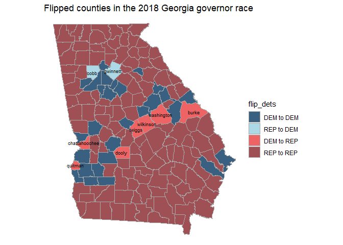
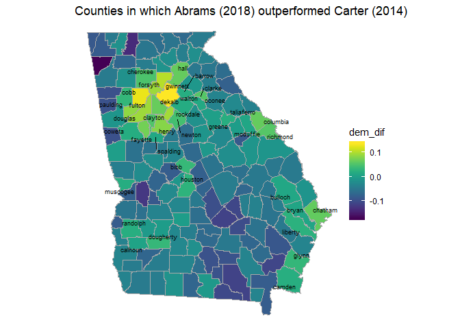
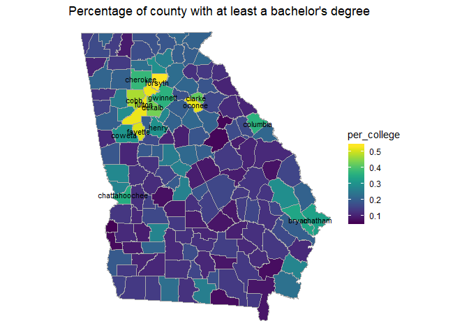
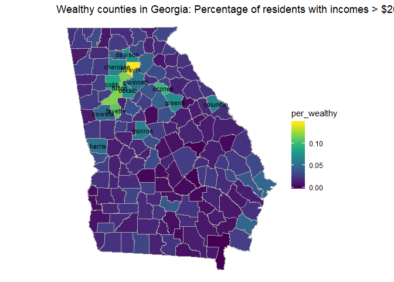
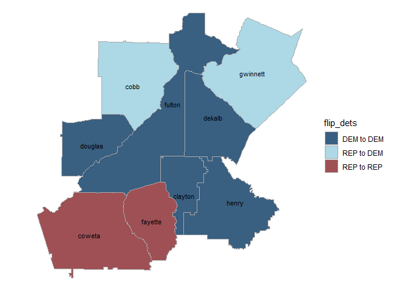

The 2018 Georgia Governor Race
================
Chad Peltier
2/3/2020

The 2018 Georgia governor race between Stacey Abrams and Brian Kemp was
notable not only for how close Democrats were to flipping a long-held
Republican state (48.8% to 50.2%), but also for widespread reports of
voter suppression.

In the lead-up to the election, then-Secretary of State Brian Kemp
oversaw the closure of about 8% of local voting precincts and the
removal of nearly 100,000 names from the voter registry because of
Georgia’s “use it or lose it” bill. These actions led to allegations of
[voter
suppression](https://www.nytimes.com/2019/12/27/us/elections/georgia-voters-purge.html),
as the purge was seen as [unjustly targeting black and low-income
voters](https://www.nytimes.com/2018/10/19/us/politics/georgia-voter-suppression.html?searchResultPosition=2).

Nationally the 2018 midterms were defined by a [few notable
trends](https://fivethirtyeight.com/features/the-2018-midterms-in-4-charts/):

  - [Democratic gains in the
    suburbs](https://fivethirtyeight.com/features/the-suburbs-all-kinds-of-suburbs-delivered-the-house-to-democrats/)
  - Unprecedented levels of voter turnout (Georgia featured an estimated
    55% turnout, for example)
  - A surge of newly-elected – and female – representatives

Turning to the 2020 election, there is some suggestion that Georgia
could be [close to a swing
state](https://www.cnn.com/2019/11/20/politics/georgia-democrats-2020-election/index.html).
There are an extraordinary number of variables that might affect whether
Democrats can flip Georgia seats in nearly every race, but it is likely
that they will have to both consolidate (i.e. the 6th District) and
expand upon gains from the 2018 midterms.

This project is just an introductory look at some of the 2018 governor
race results, as well as a look at demographic trends in Georgia that
could be relevant in 2020 and beyond. Data is largely from the
tidycensus package, which includes the 2017 American Community Survey
(ACS) results used here. Election data is from the Georgia Secretary of
State website.

First we can load all of the packages we’ll need.

# Data

The following code joins multiple election and ACS demographic datasets
together by county (the geographic level of detail provided by the GA
SoS election results). It combines (1) educational attainment data
(specifically the estimated percentage of residents with a college
degree – likely the primary predictor of voting for Donald Trump in
2016), (2) 2018 general election Georgia voter turnout by demographic
group, (3) 2018 general election governor race results, and (4) the
percentage of wealthy voters by county (annual incomes \> $200k).

Of note, our first ACS data download from the Tidycensus package
includes the “geometry = TRUE” option, which allows us to conveniently
download SF geometries for the geography of interest (counties) in
Georgia.

    ## Getting data from the 2013-2017 5-year ACS

    ## Downloading feature geometry from the Census website.  To cache shapefiles for use in future sessions, set `options(tigris_use_cache = TRUE)`.

    ## Getting data from the 2013-2017 5-year ACS

    ## Downloading feature geometry from the Census website.  To cache shapefiles for use in future sessions, set `options(tigris_use_cache = TRUE)`.

``` r
## educational attainment - tidycensus
ga_edu2 <- ga_edu %>%
    mutate(type = if_else(variable == "B23006_001", "total population", "college degree")) %>%
    group_by(GEOID) %>%
    mutate(per_college = estimate[type == "college degree"] / estimate[type == "total population"],
           NAME = str_to_lower(str_extract(NAME, ".+(?=\\sCounty, Georgia)"))) %>%
    filter(type == "college degree")

## Add in turnout data - from the GA SoS website
ga_turnout <- read_csv("ga_county_turnout.csv")
```

    ## Parsed with column specification:
    ## cols(
    ##   .default = col_double(),
    ##   county_name = col_character(),
    ##   country_code = col_character()
    ## )

    ## See spec(...) for full column specifications.

``` r
ga_turnout <- ga_turnout %>%
    mutate(county_name = str_to_lower(county_name))

ga_edu_election <- ga_edu2 %>%
    left_join(ga_turnout, by = c("NAME" = "county_name"))

## Add in voting data - from the GA SoS website
gov_votes <- read_csv("gov_votes.csv") %>%
    mutate(County = str_to_lower(County),
           winner = if_else(total_votes_abrams > total_votes_kemp, "abrams", "kemp"),
           election_year = 2018)
```

    ## Parsed with column specification:
    ## cols(
    ##   County = col_character(),
    ##   registered_voters = col_double(),
    ##   total_votes_kemp = col_double(),
    ##   total_votes_abrams = col_double(),
    ##   total_votes_metz = col_double(),
    ##   total_votes = col_double()
    ## )

``` r
gov_2014 <- read_csv("gov_2014.csv") %>%
    mutate(county = str_to_lower(county),
           per_carter = carter_votes / total)
```

    ## Parsed with column specification:
    ## cols(
    ##   county = col_character(),
    ##   deal_votes = col_double(),
    ##   carter_votes = col_double(),
    ##   hunt_votes = col_double(),
    ##   total = col_number()
    ## )

``` r
gov_votes <- gov_votes %>%
    left_join(gov_2014, by = c("County" = "county")) %>%
    mutate(per_abrams = total_votes_abrams / total_votes,
           winner_18 = winner,
           winner_14 = if_else(carter_votes > deal_votes, "carter", "deal"),
           dem_dif = per_abrams - per_carter
    )

gov_votes <- gov_votes %>%
    select(County, 13:17)

ga_edu_election <- ga_edu_election %>%
    left_join(gov_votes, by = c("NAME" = "County"))

## add in wealthy voters - tidycensus
ga_wealthy <- ga_wealthy %>%
    mutate(type = if_else(variable == "B19001_001", "all voters", "over $200k")) %>%
    group_by(GEOID) %>%
    mutate(per_wealthy = estimate[type == "over $200k"] / estimate[type == "all voters"],
           NAME = str_to_lower(str_extract(NAME, ".+(?=\\sCounty, Georgia)"))) %>%
    filter(type == "over $200k")

ga_wealthy_select <- ga_wealthy %>%
    select(GEOID, NAME, per_wealthy) 

st_geometry(ga_wealthy_select) <- NULL

ga_wealthy_select <- as_tibble(ga_wealthy_select)

ga_edu_election2 <- ga_edu_election %>%
    left_join(ga_wealthy_select, by = c("NAME", "GEOID")) %>%
    mutate(flip_dets = if_else(winner_14 == "carter" & winner_18 == "abrams", "DEM to DEM",
                        if_else(winner_14 == "deal" & winner_18 == "abrams", "REP to DEM",
                          if_else(winner_14 == "carter" & winner_18 == "kemp", "DEM to REP",
                                  if_else(winner_14 == "deal" & winner_18 == "kemp", "REP to REP",
                                          "other")))))
```

# Maps

Next we can make some maps based on the dataset above. This is just an
introductory look at both the results and the demographic trends. In the
future we can look more deeply into turnout by demographic groups, how
education and income levels affected turnout and voting preferences, and
more.

This section is inspired in part by [Jason Timm’s work on New Mexico
politics](https://www.jtimm.net/2019/01/17/xochitl-torres-small-win-2018/).

As we can see below, Stacey Abrams notably flipped two Atlanta suburban
counties – Cobb and Gwinnett. Analyzing their demographic makeups and
turnout (and comparing them with Democratically-flipped districts
country-wide) would be very interesting for a follow-up post. However,
there were several middle-Georgia counties that flipped from
Democrat-to-Republican, including Washington, Wilkinson, and Burke,
among others.

The chart comparing the actual democrat percentages by county between
Carter (2014) and Abrams reinforce how she overperformed 2014
particularly surrounding Atlanta.

``` r
flip_dets <- c('DEM to DEM', 'REP to DEM', "DEM to REP", 'REP to REP')
flip_pal <- c('#395f81', 'lightblue', "indianred2", '#9e5055')
names(flip_pal) <- flip_dets

ga_edu_election2$flip_dets <- factor(ga_edu_election2$flip_dets, 
                                     levels = c("DEM to DEM", "REP to DEM", "DEM to REP", "REP to REP"))

# Flipped counties
ga_edu_election2 %>%
    ggplot() +
    geom_sf(aes(fill = flip_dets), color = "darkgray") +
    geom_sf_text(data = ga_edu_election2 %>% filter(flip_dets == "REP to DEM" | flip_dets == "DEM to REP"), aes(label = NAME), size = 2.5) + # This labels only the counties that flipped
    theme_void() +
    scale_fill_manual(values = flip_pal) +
    ggtitle("Flipped counties in the 2018 Georgia governor race")
```

<!-- -->

``` r
    ggsave("gov_flips.png",  height = 9/1.2, width = 16/1.2)

# Comparison Carter / Abrams
ga_edu_election2 %>%
    ggplot() +
    geom_sf(aes(fill = dem_dif), color = "darkgray") +
    geom_sf_text_repel(data = ga_edu_election2 %>% filter(dem_dif > 0), aes(label = NAME), size = 2.5) + # This labels only the counties that flipped
    theme_void() +
    scale_fill_viridis() +
    ggtitle("Counties in which Abrams (2018) outperformed Carter (2014)") +
    #scale_fill_gradient(low = "indianred2", high = 'lightblue' )
    ggsave("gov_flips2.png",  height = 9/1.2, width = 16/1.2)
```

<!-- -->

``` r
# Education    
ga_edu_election2 %>%
    ggplot() +
    geom_sf(aes(fill = per_college), color = "darkgray") + 
    scale_fill_viridis() + 
    geom_sf_text(data = ga_edu_election2 %>% filter(per_college > 0.3), 
                       aes(label = NAME), size = 3) +
    theme_void() +
    ggtitle("Percentage of county with at least a bachelor's degree")
```

<!-- -->

``` r
# Incomes >$200k
ga_edu_election2 %>%
    ggplot() +
    geom_sf(aes(fill = per_wealthy), color = "darkgray") + 
    scale_fill_viridis() + 
    geom_sf_text(data = ga_edu_election2 %>% filter(per_wealthy > 0.05), 
                       aes(label = NAME), size = 3) +
    theme_void() +
    ggtitle("Wealthy counties in Georgia: Percentage of residents with incomes > $200k")
```

<!-- -->

# Atlanta only

The final view is a look at Atlanta counties that flipped.

``` r
atlanta_counties <- c("fulton", "dekalb", "gwinnett",
                      "cobb", "clayton", "coweta",
                      "douglas", "fayette", "henry")


atl_edu <- ga_edu_election2 %>%
    filter(NAME %in% atlanta_counties)

## Plots
atl_edu %>%
    ggplot() +
    geom_sf(aes(fill = flip_dets), color = "darkgray") +
    geom_sf_text(aes(label = NAME), size = 3) +
    theme_void() +
    scale_fill_manual(values = flip_pal) +
    ggsave("atl_flips.png",  height = 9/1.2, width = 16/1.2)
```

    ## Warning in st_point_on_surface.sfc(data$geometry): st_point_on_surface may not
    ## give correct results for longitude/latitude data
    
    ## Warning in st_point_on_surface.sfc(data$geometry): st_point_on_surface may not
    ## give correct results for longitude/latitude data

<!-- -->
