Analysis of Elizabeth Warren’s Presidential Campaign
================
Chad Peltier
3/2/2020

On October 16th 2019, Senator Elizabeth Warren [hit 23.7% in
FiveThirtyEight’s weighted polling
average](https://projects.fivethirtyeight.com/polls/president-primary-d/national/)
of the 2020 Democratic primary. After consistently polling between five
and seven percent until May 2019, she slowly gained in national polls
until the
[media](https://www.nytimes.com/2019/10/24/us/politics/2020-race-democrats-polls.html)
began to describe Warren as the primary’s co-front-runner. Her steady,
five month rise had been juxtaposed against flat polling for the other
major candidates, Joe Biden (who polled at 28.9% on May 1st and 27% on
October 16th) and Bernie Sanders (who polled at 16.3% on May 1st and
14.6% on October 16th). While the [FiveThirtyEight primary
forecast](https://projects.fivethirtyeight.com/2020-primary-forecast/)
had not yet launched, it retroactively would have given Warren a
nearly-equal probability of becoming the party’s nominee as Joe Biden in
early November 2019. In January 2020 the New York Times endorsed Warren
(and Amy Klobuchar) for the nomination.

But then the [4th Democratic
Debate](https://fivethirtyeight.com/live-blog/fourth-democratic-primary-debate/)
happened, as nearly everyone piled on the newly-anointed
(co)front-runner. While pundits generally praised Warren’s performance –
[the New York Times’ opinion writers gave Warren the top
performance](https://www.nytimes.com/interactive/2019/10/16/opinion/debate-winners.html)
on the night – voters latched on to her rivals’ criticisms, and her
mid-October polls ended up as the high point of her national polling
average. After disappointing finishes in Iowa, New Hampshire, and Nevada
– followed by a third-place finish in her home state of Massachusetts on
Super Tuesday, Warren dropped out of the presidential race.

What changed after that October debate? What factors prevented her
consolidation of voters in late 2019 and early 2020? Almost every
political news organization has posted numerous theories: Sexism
[probably
played](https://fivethirtyeight.com/features/did-sexism-and-fear-of-sexism-keep-warren-from-winning-the-nomination/)
a [critical
role](https://www.dataforprogress.org/blog/3/5/sexism-one-reason-why-warren-didnt-do-better),
for starters. It likely fueled the concerns over “electability”, a
nebulous concept that has more to do with herd behavior than individual
preferences (as my wife argued, everyone incorrectly estimating what
someoneelse’s preferences are) in a year in which voters have
consistently argued in polling that they would prefer someone who can
beat Trump over anything else. Warren was the clear favorite [magic
wand](https://www.dataforprogress.org/blog/2019/7/30/ambivalent-support-why-do-primary-voters-say-theyll-vote-for-a-non-preferred-candidate)
candidate – who voters would magically, immediately make President.

The release of the massive [Democracy Fund + UCLA Nationscape polling
data](https://www.usatoday.com/in-depth/news/politics/elections/2020/02/28/nationscape-research-voters-views-on-several-policies-remain-polarized/4569383002/?link_id=10&can_id=8f8a3198bb402b42b1635b935f7d8afc&source=email-weekend-reading-march-1-2020&email_referrer=email_737723&email_subject=weekend-reading-march-1-2020)
allows us to look at Warren’s polling over time and in relation to
numerous other demographic and cultural factors as well as policy
preferences to get a better sense for why Warren’s campaign hit a wall
in mid-October and never recovered.

``` r
library(tidycensus)
```

    ## Warning: package 'tidycensus' was built under R version 3.6.2

``` r
library(tidyverse)
```

    ## Warning: package 'ggplot2' was built under R version 3.6.3

``` r
library(tigris)
```

    ## Warning: package 'tigris' was built under R version 3.6.2

``` r
library(tidyverse)
library(sf)
```

    ## Warning: package 'sf' was built under R version 3.6.2

``` r
library(haven)
```

    ## Warning: package 'haven' was built under R version 3.6.2

``` r
library(viridis)
```

    ## Warning: package 'viridis' was built under R version 3.6.2

``` r
library(lubridate)
library(ggthemes)
```

First we’ll read in all of the Nationscape files and combine them into a
gargantuan dataset using purrr::map and haven::read\_dta to handle .dta
files.

``` r
ns_list <- list.files(pattern = "*.dta")

test <- read_dta("ns20190718.dta")


# Iterate through list of files
ns_sum <- map(ns_list, read_dta) %>%
    bind_rows

write.csv(ns_sum, file = "ns_sum.csv")
```

# Warren analysis

Let’s start with some basic summaries and charts about Warren’s
popularity.

``` r
# Warren
ns_sum %>%
    filter((cand_favorability_warren == 3 | cand_favorability_warren == 4) & 
               cand_favorability_warren != 999 & cand_favorability_sanders != 999 &
               cand_favorability_cortez != 999 & cand_favorability_trump != 999) %>%
    summarise(sanders = mean(cand_favorability_sanders, na.rm = TRUE),
              aoc = mean(cand_favorability_cortez, na.rm = TRUE),
              trump = mean(cand_favorability_trump, na.rm = TRUE))
```

    ## # A tibble: 1 x 3
    ##   sanders   aoc trump
    ##     <dbl> <dbl> <dbl>
    ## 1    3.34  3.57  2.04

``` r
# Warren over time
ns_sum %>%
    filter(cand_favorability_warren != 999 & !is.na(cand_favorability_warren) & !is.na(pid3)) %>%
    mutate(start_date = ymd(str_remove(start_date, "\\s.+")),
           cand_favorability_warren = if_else(cand_favorability_warren == 1 | 
                                            cand_favorability_warren == 2, "positive", "negative"),
           pid3 = if_else(pid3 == 1, "Democrat", 
                          if_else(pid3 == 2, "Republican",
                                  if_else(pid3 == 3, "Independent", "Other")))) %>%
    group_by(start_date, cand_favorability_warren, pid3) %>%
    summarize(warren = n()) %>%
    mutate(warren_percent = warren/sum(warren)) %>%
    filter(cand_favorability_warren == "positive") %>%
    ggplot(aes(x = start_date, y = warren_percent)) + 
        geom_point() +
        geom_smooth() +
        facet_wrap(~ pid3) +
        scale_y_continuous(labels = scales::percent_format()) +
        ggtitle("Elizabeth Warren Favorability by Party ID")
```

    ## `geom_smooth()` using method = 'loess' and formula 'y ~ x'

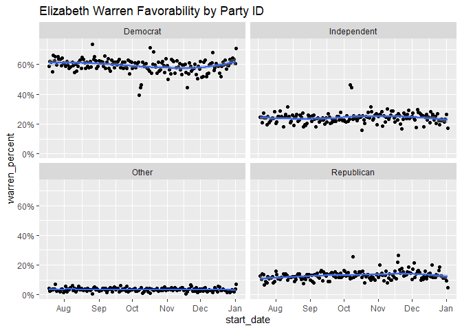<!-- -->

``` r
f_ew <- ns_sum %>%
    filter(cand_favorability_warren != 999 & !is.na(cand_favorability_warren) & pid3 == 1) %>%
    mutate(start_date = ymd(str_remove(start_date, "\\s.+")),
           cand_favorability_warren = if_else(cand_favorability_warren == 1 | 
                                            cand_favorability_warren == 2, "positive", "negative"),
           pid3 = if_else(pid3 == 1, "Democrat", 
                          if_else(pid3 == 2, "Republican",
                                  if_else(pid3 == 3, "Independent", "Other")))) %>%
    group_by(start_date, cand_favorability_warren) %>%
    summarize(warren = n()) %>%
    #group_by(start_date) %>%
    mutate(warren_percent = warren/sum(warren)) %>%
    filter(cand_favorability_warren == "positive") %>%
    ggplot(aes(x = start_date, y = warren_percent)) + 
        geom_point() +
        geom_smooth() +
        scale_y_continuous(labels = scales::percent_format()) +
        ylim(.7, 1) +
        ggtitle("Elizabeth Warren Favorability Among Democrats")
```

    ## Scale for 'y' is already present. Adding another scale for 'y', which will
    ## replace the existing scale.

``` r
ns_sum %>%
    filter(cand_favorability_warren != 999 & !is.na(cand_favorability_warren)) %>%
    mutate(start_date = ymd(str_remove(start_date, "\\s.+")),
           cand_favorability_warren = if_else(cand_favorability_warren == 1 | 
                                            cand_favorability_warren == 2, "positive", "negative")) %>%
    group_by(start_date, cand_favorability_warren) %>%
    summarize(warren = n()) %>%
    mutate(warren_percent = warren/sum(warren)) %>%
    filter(cand_favorability_warren == "positive") %>%
    ggplot(aes(x = start_date, y = warren_percent)) + 
        geom_point() +
        geom_smooth() +
        scale_y_continuous(labels = scales::percent_format()) +
        ggtitle("Elizabeth Warren Favorability")
```

    ## `geom_smooth()` using method = 'loess' and formula 'y ~ x'

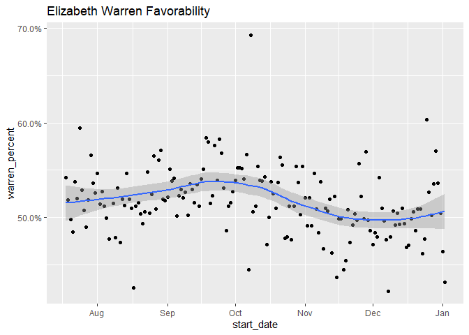<!-- -->

``` r
ns_sum %>%
    filter(cand_favorability_warren != 999 & !is.na(cand_favorability_warren)) %>%
    mutate(start_date = ymd(str_remove(start_date, "\\s.+")),
           cand_favorability_warren = if_else(cand_favorability_warren == 1 | 
                                            cand_favorability_warren == 2, "positive", "negative"),
           gender = as.factor(if_else(gender==1, "Female", "Male"))) %>%
    group_by(start_date, gender, cand_favorability_warren) %>%
    summarize(warren = n()) %>%
    mutate(warren_percent = warren/sum(warren)) %>%
    filter(cand_favorability_warren == "positive") %>%
    ggplot(aes(x = start_date, y = warren_percent, color = gender)) + 
        geom_point() +
        geom_smooth(aes(group = gender)) +
        scale_y_continuous(labels = scales::percent_format()) +
        ggtitle("Elizabeth Warren Favorability by Gender")
```

    ## `geom_smooth()` using method = 'loess' and formula 'y ~ x'

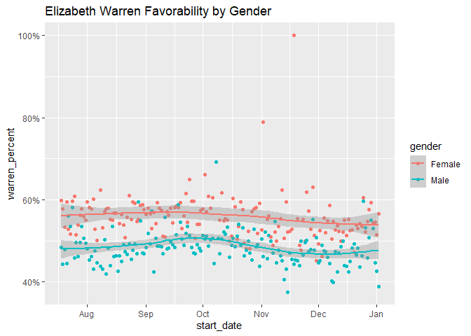<!-- -->

``` r
ns_sum %>%
    filter(cand_favorability_warren != 999 & !is.na(cand_favorability_warren) & !is.na(pid3)) %>%
    mutate(start_date = ymd(str_remove(start_date, "\\s.+")),
           cand_favorability_warren = if_else(cand_favorability_warren == 1 | 
                                            cand_favorability_warren == 2, "positive", "negative"),
           gender = as.factor(if_else(gender==1, "Female", "Male")),
           pid3 = if_else(pid3 == 1, "Democrat", 
                          if_else(pid3 == 2, "Republican",
                                  if_else(pid3 == 3, "Independent", "Other")))) %>%
    group_by(start_date, gender, pid3, cand_favorability_warren) %>%
    summarize(warren = n()) %>%
    mutate(warren_percent = warren/sum(warren)) %>%
    filter(cand_favorability_warren == "positive") %>%
    ggplot(aes(x = start_date, y = warren_percent, color = gender)) + 
        geom_point() +
        geom_smooth(aes(group = gender)) +
        facet_wrap(~ pid3) +
        scale_y_continuous(labels = scales::percent_format()) +
        ggtitle("Elizabeth Warren Favorability by Gender")
```

    ## `geom_smooth()` using method = 'loess' and formula 'y ~ x'

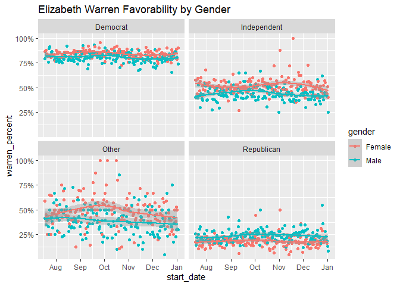<!-- -->

``` r
## favorability vs. intent to vote
ns_warren_percent <- ns_sum %>%
    filter(cand_favorability_warren != 999 & !is.na(cand_favorability_warren) & pid3 == 1) %>%
    mutate(start_date = ymd(str_remove(start_date, "\\s.+")),
           cand_favorability_warren = if_else(cand_favorability_warren == 1 | 
                                            cand_favorability_warren == 2, "positive", "negative"),
           pid3 = if_else(pid3 == 1, "Democrat", 
                          if_else(pid3 == 2, "Republican",
                                  if_else(pid3 == 3, "Independent", "Other")))) %>%
    group_by(start_date, cand_favorability_warren) %>%
    summarize(warren = n()) %>%
    mutate(warren_percent = warren/sum(warren)) %>%
    filter(cand_favorability_warren == "positive") %>%
    select(start_date, warren_percent)

ns_warren_intent <- ns_sum %>% 
    filter(dem_vote_intent != 888 & dem_vote_intent != 999 & !is.na(dem_vote_intent)) %>%
     mutate(start_date = ymd(str_remove(start_date, "\\s.+"))) %>%
    select(start_date, dem_vote_intent) %>% 
    group_by(start_date, dem_vote_intent) %>% 
    summarize(warren_intent = n()) %>%
    group_by(start_date) %>%
    mutate(warren_intent_percent = warren_intent/sum(warren_intent)) %>%
    filter(dem_vote_intent == 8) %>%
    select(start_date, warren_intent_percent) %>%
    inner_join(ns_warren_percent, by = "start_date")


ns_warren_intent %>%
    pivot_longer(cols = c(warren_intent_percent, warren_percent), 
                 names_to = "name", values_to = "values") %>%
    ggplot(aes(x = start_date, y = values, color = name, group = name)) + 
        geom_point() +
        geom_smooth() +
        scale_y_continuous(labels = scales::percent_format()) +
        ggtitle("Elizabeth Warren Favorability vs. Intent to Vote Among Democrats")
```

    ## `geom_smooth()` using method = 'loess' and formula 'y ~ x'

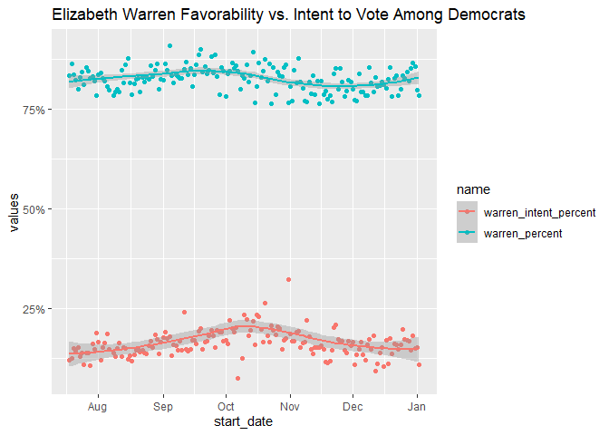<!-- -->

``` r
ns_warren_intent %>%
    ggplot(aes(x = warren_percent, y = warren_intent_percent)) + 
        geom_point() +
        geom_smooth() +
        scale_y_continuous(labels = scales::percent_format()) +
        ggtitle("Elizabeth Warren Favorability vs. Intent to Vote Among Democrats")
```

    ## `geom_smooth()` using method = 'loess' and formula 'y ~ x'

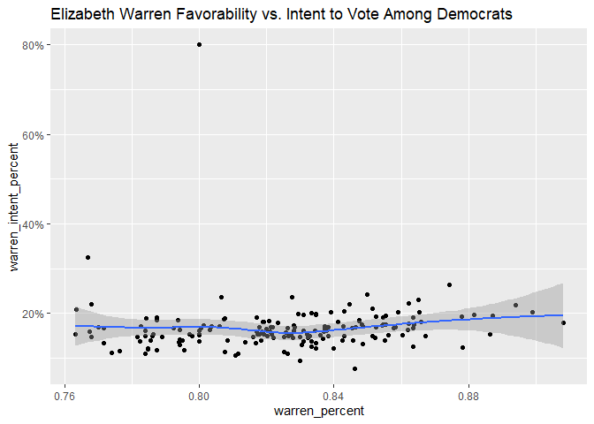<!-- -->

``` r
## Liz vs. Bernie
ns_sum %>%
    filter(cand_favorability_sanders != 999 & !is.na(cand_favorability_sanders) & pid3 == 1 &
               cand_favorability_warren != 999 & !is.na(cand_favorability_warren)) %>%
    mutate(start_date = ymd(str_remove(start_date, "\\s.+")),
           cand_favorability_sanders = if_else(cand_favorability_sanders == 1 | 
                                            cand_favorability_sanders == 2, 1, 0),
           cand_favorability_warren = if_else(cand_favorability_warren == 1 | 
                                            cand_favorability_warren == 2, 1, 0),
           pid3 = if_else(pid3 == 1, "Democrat", 
                          if_else(pid3 == 2, "Republican",
                                  if_else(pid3 == 3, "Independent", "Other")))) %>%
    select(start_date, cand_favorability_sanders, cand_favorability_warren) %>%
    pivot_longer(cols = c(cand_favorability_sanders, cand_favorability_warren), 
                 names_to = "candidate", values_to = "favorability") %>%
    group_by(start_date, candidate) %>%
    summarize(fav = mean(favorability)) %>%
    ggplot(aes(x = start_date, y = fav, color = candidate)) + 
        geom_point() +
        geom_smooth() +
        scale_y_continuous(labels = scales::percent_format()) +
        ggtitle("Elizabeth Warren vs. Bernie Sanders Favorability Among Democrats") +
        ggthemes::theme_fivethirtyeight()
```

    ## `geom_smooth()` using method = 'loess' and formula 'y ~ x'

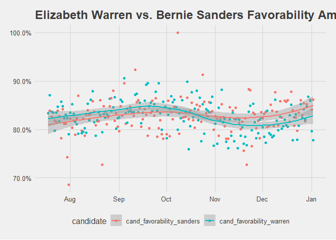<!-- -->

``` r
ggsave("liz_bernie.png", height = 9/1.2, width = 16/1.2)
```

    ## `geom_smooth()` using method = 'loess' and formula 'y ~ x'

In the plots above favorability is measured as a binary yes-no, and then
converted to a percent, rather than along the 1-4 scale used in the
original polling question.

  - Not a surprise: voters who do not like Warren also did not like
    Sanders, liked Alexandria Ocasio-Cortez even less, and liked Trump.
  - In terms of favorability by self-identified party, Democrats had
    fairly consistent support for Warren at around 60% favorability.
    Independents maintained roughly a 20-25% favorability, and
    Republicans were around 10%.
  - Warren’s overall favorability (among all polled voters) seemed to
    rise with national polls until October when she declined to roughly
    50%.
  - Warren consistently had a higher favorability among female voters
    than male voters, overall, among Democrats, and among Independents,
    but male Republican voters had a slightly higher opinion of Warren
    than female Republicans.  
  - Maybe the most critical charts are the second- and third-to-last,
    which show Warren’s favorability compared with Democrats intent to
    vote for her in their primary or caucus. There was a consistently
    wide gulf between favorability and intent to vote among Democrats
    who intended to vote, with the voters expressing over 75%
    favorability but between 20% and 25% intent to vote. The pecentage
    of Democrats intending to vote for Warren was steadily rising from
    August until mid-October when they fell back to her level from late
    summer. Warren’s favorability was much more steady despite a
    similar, brief decline. Comparing favorability and intent to vote
    directly (in the second-to-last chart) it is clear that there was no
    relationship between the two.
  - The final chart shows Warren and Sanders’ favorability head-to-head.
    Warren had a consistent but narrow lead over Sanders from summer
    until mid-October, when Sanders overtook Warren.

All of this suggests that the critical moment for Warren’s campaign was
in mid-October.

# Warren Map

Because the Nationscape data includes the individual’s congressional
district, we can also map her support using the tigris package to import
shape files for the U.S.

``` r
## map
ga_cd <- congressional_districts(class = "sf", cb = TRUE, resolution = "20m")
```

    ## 
      |                                                                            
      |                                                                      |   0%
      |                                                                            
      |===                                                                   |   4%
      |                                                                            
      |======                                                                |   9%
      |                                                                            
      |===========                                                           |  16%
      |                                                                            
      |==============                                                        |  20%
      |                                                                            
      |==================                                                    |  26%
      |                                                                            
      |=====================                                                 |  30%
      |                                                                            
      |======================                                                |  32%
      |                                                                            
      |=========================                                             |  36%
      |                                                                            
      |============================                                          |  40%
      |                                                                            
      |=============================                                         |  42%
      |                                                                            
      |================================                                      |  46%
      |                                                                            
      |=================================                                     |  48%
      |                                                                            
      |====================================                                  |  52%
      |                                                                            
      |=======================================                               |  56%
      |                                                                            
      |========================================                              |  58%
      |                                                                            
      |=============================================                         |  64%
      |                                                                            
      |===============================================                       |  68%
      |                                                                            
      |====================================================                  |  74%
      |                                                                            
      |========================================================              |  80%
      |                                                                            
      |===========================================================           |  84%
      |                                                                            
      |==============================================================        |  88%
      |                                                                            
      |===============================================================       |  90%
      |                                                                            
      |===================================================================   |  96%
      |                                                                            
      |======================================================================| 100%

``` r
states <- tigris::states()
```

    ## 
      |                                                                            
      |                                                                      |   0%
      |                                                                            
      |                                                                      |   1%
      |                                                                            
      |=                                                                     |   1%
      |                                                                            
      |=                                                                     |   2%
      |                                                                            
      |==                                                                    |   2%
      |                                                                            
      |==                                                                    |   3%
      |                                                                            
      |==                                                                    |   4%
      |                                                                            
      |===                                                                   |   4%
      |                                                                            
      |===                                                                   |   5%
      |                                                                            
      |====                                                                  |   5%
      |                                                                            
      |====                                                                  |   6%
      |                                                                            
      |=====                                                                 |   7%
      |                                                                            
      |=====                                                                 |   8%
      |                                                                            
      |======                                                                |   8%
      |                                                                            
      |======                                                                |   9%
      |                                                                            
      |=======                                                               |   9%
      |                                                                            
      |=======                                                               |  10%
      |                                                                            
      |=======                                                               |  11%
      |                                                                            
      |========                                                              |  11%
      |                                                                            
      |========                                                              |  12%
      |                                                                            
      |=========                                                             |  12%
      |                                                                            
      |=========                                                             |  13%
      |                                                                            
      |=========                                                             |  14%
      |                                                                            
      |==========                                                            |  14%
      |                                                                            
      |==========                                                            |  15%
      |                                                                            
      |===========                                                           |  15%
      |                                                                            
      |===========                                                           |  16%
      |                                                                            
      |============                                                          |  17%
      |                                                                            
      |============                                                          |  18%
      |                                                                            
      |=============                                                         |  18%
      |                                                                            
      |=============                                                         |  19%
      |                                                                            
      |==============                                                        |  19%
      |                                                                            
      |==============                                                        |  20%
      |                                                                            
      |==============                                                        |  21%
      |                                                                            
      |===============                                                       |  21%
      |                                                                            
      |===============                                                       |  22%
      |                                                                            
      |================                                                      |  22%
      |                                                                            
      |================                                                      |  23%
      |                                                                            
      |=================                                                     |  24%
      |                                                                            
      |=================                                                     |  25%
      |                                                                            
      |==================                                                    |  25%
      |                                                                            
      |==================                                                    |  26%
      |                                                                            
      |===================                                                   |  26%
      |                                                                            
      |===================                                                   |  27%
      |                                                                            
      |===================                                                   |  28%
      |                                                                            
      |====================                                                  |  28%
      |                                                                            
      |====================                                                  |  29%
      |                                                                            
      |=====================                                                 |  29%
      |                                                                            
      |=====================                                                 |  30%
      |                                                                            
      |=====================                                                 |  31%
      |                                                                            
      |======================                                                |  31%
      |                                                                            
      |======================                                                |  32%
      |                                                                            
      |=======================                                               |  32%
      |                                                                            
      |=======================                                               |  33%
      |                                                                            
      |========================                                              |  34%
      |                                                                            
      |========================                                              |  35%
      |                                                                            
      |=========================                                             |  35%
      |                                                                            
      |=========================                                             |  36%
      |                                                                            
      |==========================                                            |  37%
      |                                                                            
      |==========================                                            |  38%
      |                                                                            
      |===========================                                           |  38%
      |                                                                            
      |===========================                                           |  39%
      |                                                                            
      |============================                                          |  39%
      |                                                                            
      |============================                                          |  40%
      |                                                                            
      |============================                                          |  41%
      |                                                                            
      |=============================                                         |  41%
      |                                                                            
      |=============================                                         |  42%
      |                                                                            
      |==============================                                        |  42%
      |                                                                            
      |==============================                                        |  43%
      |                                                                            
      |===============================                                       |  44%
      |                                                                            
      |===============================                                       |  45%
      |                                                                            
      |================================                                      |  45%
      |                                                                            
      |================================                                      |  46%
      |                                                                            
      |=================================                                     |  46%
      |                                                                            
      |=================================                                     |  47%
      |                                                                            
      |=================================                                     |  48%
      |                                                                            
      |==================================                                    |  48%
      |                                                                            
      |==================================                                    |  49%
      |                                                                            
      |===================================                                   |  49%
      |                                                                            
      |===================================                                   |  50%
      |                                                                            
      |===================================                                   |  51%
      |                                                                            
      |====================================                                  |  51%
      |                                                                            
      |====================================                                  |  52%
      |                                                                            
      |=====================================                                 |  52%
      |                                                                            
      |=====================================                                 |  53%
      |                                                                            
      |=====================================                                 |  54%
      |                                                                            
      |======================================                                |  54%
      |                                                                            
      |======================================                                |  55%
      |                                                                            
      |=======================================                               |  55%
      |                                                                            
      |=======================================                               |  56%
      |                                                                            
      |========================================                              |  57%
      |                                                                            
      |========================================                              |  58%
      |                                                                            
      |=========================================                             |  58%
      |                                                                            
      |=========================================                             |  59%
      |                                                                            
      |==========================================                            |  59%
      |                                                                            
      |==========================================                            |  60%
      |                                                                            
      |==========================================                            |  61%
      |                                                                            
      |===========================================                           |  61%
      |                                                                            
      |===========================================                           |  62%
      |                                                                            
      |============================================                          |  62%
      |                                                                            
      |============================================                          |  63%
      |                                                                            
      |=============================================                         |  64%
      |                                                                            
      |=============================================                         |  65%
      |                                                                            
      |==============================================                        |  65%
      |                                                                            
      |==============================================                        |  66%
      |                                                                            
      |===============================================                       |  66%
      |                                                                            
      |===============================================                       |  67%
      |                                                                            
      |===============================================                       |  68%
      |                                                                            
      |================================================                      |  68%
      |                                                                            
      |================================================                      |  69%
      |                                                                            
      |=================================================                     |  70%
      |                                                                            
      |=================================================                     |  71%
      |                                                                            
      |==================================================                    |  71%
      |                                                                            
      |==================================================                    |  72%
      |                                                                            
      |===================================================                   |  72%
      |                                                                            
      |===================================================                   |  73%
      |                                                                            
      |===================================================                   |  74%
      |                                                                            
      |====================================================                  |  74%
      |                                                                            
      |====================================================                  |  75%
      |                                                                            
      |=====================================================                 |  75%
      |                                                                            
      |=====================================================                 |  76%
      |                                                                            
      |======================================================                |  77%
      |                                                                            
      |======================================================                |  78%
      |                                                                            
      |=======================================================               |  78%
      |                                                                            
      |=======================================================               |  79%
      |                                                                            
      |========================================================              |  79%
      |                                                                            
      |========================================================              |  80%
      |                                                                            
      |========================================================              |  81%
      |                                                                            
      |=========================================================             |  81%
      |                                                                            
      |=========================================================             |  82%
      |                                                                            
      |==========================================================            |  82%
      |                                                                            
      |==========================================================            |  83%
      |                                                                            
      |==========================================================            |  84%
      |                                                                            
      |===========================================================           |  84%
      |                                                                            
      |===========================================================           |  85%
      |                                                                            
      |============================================================          |  85%
      |                                                                            
      |============================================================          |  86%
      |                                                                            
      |=============================================================         |  86%
      |                                                                            
      |=============================================================         |  87%
      |                                                                            
      |=============================================================         |  88%
      |                                                                            
      |==============================================================        |  88%
      |                                                                            
      |==============================================================        |  89%
      |                                                                            
      |===============================================================       |  89%
      |                                                                            
      |===============================================================       |  90%
      |                                                                            
      |===============================================================       |  91%
      |                                                                            
      |================================================================      |  91%
      |                                                                            
      |================================================================      |  92%
      |                                                                            
      |=================================================================     |  92%
      |                                                                            
      |=================================================================     |  93%
      |                                                                            
      |=================================================================     |  94%
      |                                                                            
      |==================================================================    |  94%
      |                                                                            
      |==================================================================    |  95%
      |                                                                            
      |===================================================================   |  95%
      |                                                                            
      |===================================================================   |  96%
      |                                                                            
      |====================================================================  |  97%
      |                                                                            
      |====================================================================  |  98%
      |                                                                            
      |===================================================================== |  98%
      |                                                                            
      |===================================================================== |  99%
      |                                                                            
      |======================================================================|  99%
      |                                                                            
      |======================================================================| 100%

``` r
states <- states@data 
states <- states %>%
    select(STATEFP, NAME)

ga_cd <- ga_cd %>% 
    left_join(states, by = "STATEFP")

state_abb <- state.abb %>%
    tibble() %>%
    cbind(state.name) %>%
    rename(state_abb = 1)

ga_cd <- ga_cd %>% 
    left_join(state_abb, by = c("NAME" = "state.name"))
```

    ## Warning: Column `NAME`/`state.name` joining character vector and factor,
    ## coercing into character vector

``` r
ga_cd <- ga_cd %>%
    unite(col = congress_district, state_abb, CD115FP, sep = "")

head(ga_cd)
```

    ## Simple feature collection with 6 features and 9 fields
    ## geometry type:  MULTIPOLYGON
    ## dimension:      XY
    ## bbox:           xmin: -85.79066 ymin: 33.81732 xmax: -73.68366 ymax: 43.34321
    ## epsg (SRID):    4269
    ## proj4string:    +proj=longlat +datum=NAD83 +no_defs
    ##   STATEFP congress_district      AFFGEOID GEOID LSAD CDSESSN      ALAND
    ## 1      13              GA11 5001500US1311  1311   C2     115 2773088054
    ## 2      26              MI03 5001500US2603  2603   C2     115 6810456342
    ## 3      36              NY25 5001500US3625  3625   C2     115 1321389767
    ## 4      36              NY07 5001500US3607  3607   C2     115   41806002
    ## 5      36              NY09 5001500US3609  3609   C2     115   40267196
    ## 6      36              NY05 5001500US3605  3605   C2     115  134511928
    ##       AWATER     NAME                       geometry
    ## 1   70602060  Georgia MULTIPOLYGON (((-85.04687 3...
    ## 2  177813904 Michigan MULTIPOLYGON (((-85.79045 4...
    ## 3 1831700038 New York MULTIPOLYGON (((-77.9957 43...
    ## 4    2675060 New York MULTIPOLYGON (((-74.03093 4...
    ## 5     502409 New York MULTIPOLYGON (((-73.9796 40...
    ## 6  184543098 New York MULTIPOLYGON (((-73.82641 4...

``` r
ns_warren <- ns_sum %>%
    filter(cand_favorability_warren != 999 & !is.na(cand_favorability_warren) & !is.na(pid3)) %>%
    mutate(start_date = ymd(str_remove(start_date, "\\s.+")),
           cand_favorability_warren = if_else(cand_favorability_warren == 1 | 
                                            cand_favorability_warren == 2, "positive", "negative"),
           gender = as.factor(if_else(gender==1, "Female", "Male")),
           pid3 = if_else(pid3 == 1, "Democrat", 
                          if_else(pid3 == 2, "Republican",
                                  if_else(pid3 == 3, "Independent", "Other")))) %>%
    select(cand_favorability_warren, gender, pid3, start_date, congress_district, state) %>%
    left_join(ga_cd, by = "congress_district")


ns_warren %>%
    group_by(congress_district, cand_favorability_warren) %>%
    summarize(n = n()) %>%
    group_by(congress_district) %>%
    summarise(percent_pos = sum(n[cand_favorability_warren=="positive"])/sum(n)) %>%
    left_join(ga_cd, by = "congress_district") %>%
    filter(!str_detect(congress_district, "HI") & !str_detect(congress_district, "AK")) %>%
    ggplot(aes(fill = percent_pos)) +
        geom_sf(aes(geometry = geometry)) +
        ggthemes::theme_map() +
        ggtitle("Warren Favorability by Congressional District") +
        labs(caption = "Data from Nationscape project. Favorability includes percent of polled with very favorable or somewhat favorable opinion.") +
        scale_fill_viridis(direction = -1)
```

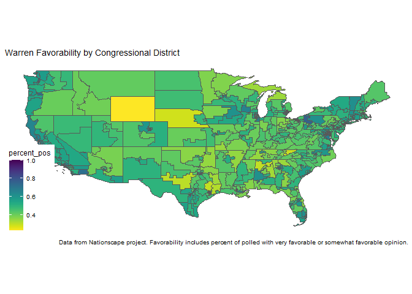<!-- -->

``` r
ggsave("ns_warren_map2.png", width = 16/1.2, height = 9/1.2)


ns_warren %>%
    filter(pid3 == "Democrat") %>%
    group_by(congress_district, cand_favorability_warren) %>%
    summarize(n = n()) %>%
    group_by(congress_district) %>%
    summarise(percent_pos = sum(n[cand_favorability_warren=="positive"])/sum(n)) %>%
    left_join(ga_cd, by = "congress_district") %>%
    filter(!str_detect(congress_district, "HI") & !str_detect(congress_district, "AK")) %>%
    ggplot(aes(fill = percent_pos)) +
        geom_sf(aes(geometry = geometry)) +
        ggthemes::theme_map() +
        ggtitle("Warren Favorability Among Democrats by Congressional District") +
        labs(caption = "Data from Democracy Fund + UCLA Nationscape project. Favorability includes percent of Democrats polled with very favorable or somewhat favorable opinion.") +
        #scale_fill_viridis(direction = -1) +
        scale_fill_binned(type = "viridis", direction = -1)
```

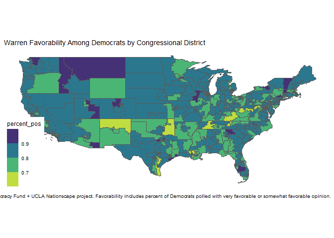<!-- -->

``` r
ggsave("ns_warren_map3.png", width = 16/1.2, height = 9/1.2)


## intent to vote - edit below
ns_sum %>%
    filter(pid3 == 1) %>%
    group_by(congress_district, dem_vote_intent) %>%
    summarize(n = n()) %>%
    mutate(warren_intent_percent = n/sum(n)) %>%
    filter(dem_vote_intent == 8) %>%
    group_by(congress_district) %>%
    left_join(ga_cd, by = "congress_district") %>%
    filter(!str_detect(congress_district, "HI") & !str_detect(congress_district, "AK")) %>%
    ggplot(aes(fill = warren_intent_percent)) +
        geom_sf(aes(geometry = geometry)) +
        ggthemes::theme_map() +
        ggtitle("Warren Support Among Democrats by Congressional District") +
        labs(caption = "Data from Democracy Fund + UCLA Nationscape project. Support is defined as who the voter would support if the election were held today.") +
        #scale_fill_viridis(direction = -1) +
        scale_fill_binned(type = "viridis", direction = -1)
```

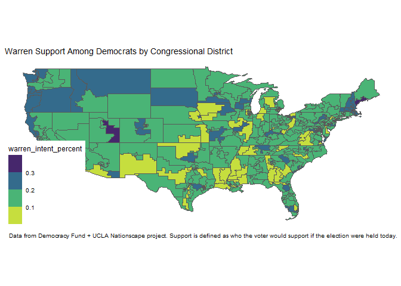<!-- -->

``` r
ggsave("ns_warren_map4.png", width = 16/1.2, height = 9/1.2)
```

The three maps above include Warren’s favorability overall, her
favorability among Democrats, and the percentage of voters who intended
to vote for her.

While Democrats had high opinions of Warren from a wide vareity of
districts from all over the country, there were far fewer districts with
more than 20% of polled voters who intended to vote for her (critical
for collecting delegates during primaries).

# Data pre-processing and a few more exploratory data plots

We can look at a few more exploratory data plots and pre-process the
data for modeling whether a democratic primary voter intended to vote
for Warren or not. As part of this process we’ll add in [data on
population density for congressional districts from City
Lab](https://www.citylab.com/equity/2018/11/citylab-congressional-density-index/575749/).

``` r
## prep data

library(naniar)
library(magrittr)
```

    ## 
    ## Attaching package: 'magrittr'

    ## The following object is masked from 'package:purrr':
    ## 
    ##     set_names

    ## The following object is masked from 'package:tidyr':
    ## 
    ##     extract

``` r
library(tidymodels)
```

    ## Registered S3 method overwritten by 'xts':
    ##   method     from
    ##   as.zoo.xts zoo

    ## -- Attaching packages ----------------

    ## v broom     0.5.2     v recipes   0.1.9
    ## v dials     0.0.4     v rsample   0.0.5
    ## v infer     0.5.1     v yardstick 0.0.5
    ## v parsnip   0.0.5

    ## -- Conflicts -------------------------
    ## x scales::discard()     masks purrr::discard()
    ## x magrittr::extract()   masks tidyr::extract()
    ## x dplyr::filter()       masks stats::filter()
    ## x recipes::fixed()      masks stringr::fixed()
    ## x dplyr::lag()          masks stats::lag()
    ## x dials::margin()       masks ggplot2::margin()
    ## x magrittr::set_names() masks purrr::set_names()
    ## x yardstick::spec()     masks readr::spec()
    ## x recipes::step()       masks stats::step()
    ## x recipes::yj_trans()   masks scales::yj_trans()

``` r
ns_select <- ns_sum %>%
    filter(pid7 < 4) %>%
    select(dem_vote_intent, interest, vote_intention, group_favorability_socialists, 
           group_favorability_labor_unions, cand_favorability_biden, cand_favorability_sanders,
           racial_attitudes_tryhard, gender_attitudes_maleboss, gender_attitudes_logical, 
           gender_attitudes_opportunity, gender_attitudes_complain, discrimination_blacks,
           discrimination_men, discrimination_women, ideo5, employment, foreign_born, in_union, 
           medicare_for_all, age, gender, household_income, education, congress_district) %>%
    mutate(vote_warren = if_else(dem_vote_intent == 8 , 1, 0),
           student = if_else(employment == 7, 1, 0),
           full_time = if_else(employment == 1, 1, 0),
           unemployed = if_else(employment == 4, 1, 0)) %>%
    select(-employment, - dem_vote_intent) %>%
    replace_with_na_all(condition = ~.x == "888") %>%
    replace_with_na_all(condition = ~.x == "999") #%>%
    #drop_na()


citylab <- read_csv("citylab.csv")
```

    ## Parsed with column specification:
    ## cols(
    ##   CD = col_character(),
    ##   Cluster = col_character(),
    ##   `Very low density` = col_double(),
    ##   `Low density` = col_double(),
    ##   `Medium density` = col_double(),
    ##   `High density` = col_double()
    ## )

``` r
colnames(citylab) %<>% str_replace_all("\\s", "_") %>% tolower()
citylab <- citylab %>%
    mutate(cd = str_remove(cd, "-"),
           cd = if_else(cd == "AKAL", "AK00", cd))

ns_select <- ns_select %>%
    left_join(citylab, by = c("congress_district" = "cd"))

## remove variables with a lot of NAs (can decide about imputing later)
ns_select <- ns_select %>%
    select(-congress_district, -cluster, -group_favorability_labor_unions, -group_favorability_socialists,
           - medicare_for_all)
## edit this if decide to impute
ns_select2 <- ns_select %>%
    drop_na() %>%
    mutate(vote_warren = as.factor(if_else(vote_warren == 1, "yes", "no")))

skimr::skim(ns_select)
```

|                                                  |            |
| :----------------------------------------------- | :--------- |
| Name                                             | ns\_select |
| Number of rows                                   | 68717      |
| Number of columns                                | 27         |
| \_\_\_\_\_\_\_\_\_\_\_\_\_\_\_\_\_\_\_\_\_\_\_   |            |
| Column type frequency:                           |            |
| numeric                                          | 27         |
| \_\_\_\_\_\_\_\_\_\_\_\_\_\_\_\_\_\_\_\_\_\_\_\_ |            |
| Group variables                                  | None       |

Data summary

**Variable type: numeric**

| skim\_variable                 | n\_missing | complete\_rate |  mean |    sd | p0 |   p25 |   p50 |   p75 |  p100 | hist  |
| :----------------------------- | ---------: | -------------: | ----: | ----: | -: | ----: | ----: | ----: | ----: | :---- |
| interest                       |         63 |           1.00 |  1.81 |  0.86 |  1 |  1.00 |  2.00 |  2.00 |  4.00 | ▇▇▁▃▁ |
| vote\_intention                |       3443 |           0.95 |  1.10 |  0.37 |  1 |  1.00 |  1.00 |  1.00 |  3.00 | ▇▁▁▁▁ |
| cand\_favorability\_biden      |       6847 |           0.90 |  1.95 |  0.89 |  1 |  1.00 |  2.00 |  2.00 |  4.00 | ▇▇▁▃▂ |
| cand\_favorability\_sanders    |       5876 |           0.91 |  1.80 |  0.84 |  1 |  1.00 |  2.00 |  2.00 |  4.00 | ▇▇▁▂▁ |
| racial\_attitudes\_tryhard     |        288 |           1.00 |  3.07 |  1.41 |  1 |  2.00 |  3.00 |  4.00 |  5.00 | ▆▆▇▆▇ |
| gender\_attitudes\_maleboss    |        294 |           1.00 |  3.48 |  1.19 |  1 |  3.00 |  3.00 |  5.00 |  5.00 | ▂▂▇▂▅ |
| gender\_attitudes\_logical     |        372 |           0.99 |  1.41 |  0.83 |  1 |  1.00 |  1.00 |  1.00 |  5.00 | ▇▂▁▁▁ |
| gender\_attitudes\_opportunity |        418 |           0.99 |  1.83 |  0.93 |  1 |  1.00 |  2.00 |  2.00 |  5.00 | ▇▆▃▁▁ |
| gender\_attitudes\_complain    |        449 |           0.99 |  3.77 |  1.28 |  1 |  3.00 |  4.00 |  5.00 |  5.00 | ▁▂▅▃▇ |
| discrimination\_blacks         |        759 |           0.99 |  1.81 |  1.00 |  1 |  1.00 |  1.00 |  2.00 |  5.00 | ▇▃▂▁▁ |
| discrimination\_men            |        992 |           0.99 |  3.88 |  1.17 |  1 |  3.00 |  4.00 |  5.00 |  5.00 | ▂▁▃▇▇ |
| discrimination\_women          |        884 |           0.99 |  2.40 |  1.07 |  1 |  2.00 |  2.00 |  3.00 |  5.00 | ▆▇▇▃▁ |
| ideo5                          |       4621 |           0.93 |  2.39 |  0.94 |  1 |  2.00 |  2.00 |  3.00 |  5.00 | ▅▇▇▂▁ |
| foreign\_born                  |          0 |           1.00 |  1.07 |  0.26 |  1 |  1.00 |  1.00 |  1.00 |  2.00 | ▇▁▁▁▁ |
| in\_union                      |        251 |           1.00 |  2.69 |  0.62 |  1 |  3.00 |  3.00 |  3.00 |  3.00 | ▁▁▂▁▇ |
| age                            |          0 |           1.00 | 43.13 | 16.45 | 18 | 29.00 | 41.00 | 57.00 | 99.00 | ▇▆▅▂▁ |
| gender                         |          0 |           1.00 |  1.43 |  0.49 |  1 |  1.00 |  1.00 |  2.00 |  2.00 | ▇▁▁▁▆ |
| household\_income              |       3157 |           0.95 |  8.89 |  6.88 |  1 |  3.00 |  7.00 | 14.00 | 24.00 | ▇▅▂▂▂ |
| education                      |          0 |           1.00 |  6.55 |  2.17 |  1 |  5.00 |  6.00 |  8.00 | 11.00 | ▂▅▇▆▃ |
| vote\_warren                   |         85 |           1.00 |  0.14 |  0.35 |  0 |  0.00 |  0.00 |  0.00 |  1.00 | ▇▁▁▁▁ |
| student                        |         29 |           1.00 |  0.06 |  0.25 |  0 |  0.00 |  0.00 |  0.00 |  1.00 | ▇▁▁▁▁ |
| full\_time                     |         29 |           1.00 |  0.42 |  0.49 |  0 |  0.00 |  0.00 |  1.00 |  1.00 | ▇▁▁▁▆ |
| unemployed                     |         29 |           1.00 |  0.07 |  0.26 |  0 |  0.00 |  0.00 |  0.00 |  1.00 | ▇▁▁▁▁ |
| very\_low\_density             |       3325 |           0.95 |  0.20 |  0.21 |  0 |  0.01 |  0.12 |  0.36 |  0.89 | ▇▂▂▁▁ |
| low\_density                   |       3325 |           0.95 |  0.27 |  0.16 |  0 |  0.16 |  0.27 |  0.39 |  0.70 | ▆▇▇▅▁ |
| medium\_density                |       3325 |           0.95 |  0.30 |  0.17 |  0 |  0.17 |  0.28 |  0.42 |  0.70 | ▆▇▆▅▂ |
| high\_density                  |       3325 |           0.95 |  0.23 |  0.28 |  0 |  0.03 |  0.11 |  0.33 |  1.00 | ▇▂▁▁▁ |

``` r
library(ggridges)
```

    ## 
    ## Attaching package: 'ggridges'

    ## The following object is masked from 'package:ggplot2':
    ## 
    ##     scale_discrete_manual

``` r
library(GGally)
```

    ## Registered S3 method overwritten by 'GGally':
    ##   method from   
    ##   +.gg   ggplot2

    ## 
    ## Attaching package: 'GGally'

    ## The following object is masked from 'package:dplyr':
    ## 
    ##     nasa

``` r
ns_select2 %>%
    ggplot(aes(x = age, y = vote_warren, fill = vote_warren)) +
        geom_density_ridges()
```

    ## Picking joint bandwidth of 2.1

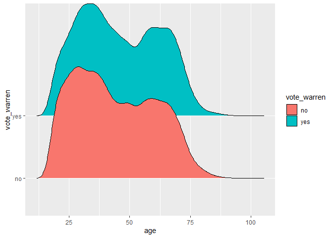<!-- -->

``` r
ns_sum %>%
    filter(dem_vote_intent %in% c(1, 7, 8)) %>%
    ggplot(aes(x = age, y = as.factor(dem_vote_intent), fill = as.factor(dem_vote_intent))) +
        geom_density_ridges()
```

    ## Picking joint bandwidth of 1.98

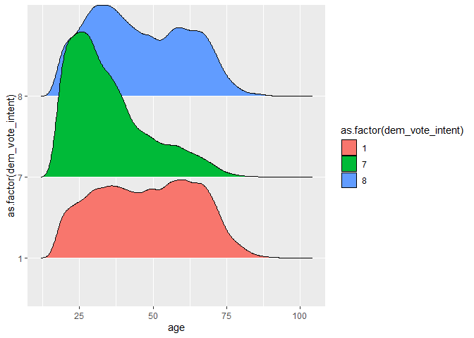<!-- -->

``` r
ns_select2 %>%
    select(vote_warren, age, gender, education, high_density, low_density, medium_density) %>%
    ggpairs(mapping = aes(color = vote_warren))
```

    ## `stat_bin()` using `bins = 30`. Pick better value with `binwidth`.

    ## `stat_bin()` using `bins = 30`. Pick better value with `binwidth`.
    ## `stat_bin()` using `bins = 30`. Pick better value with `binwidth`.
    ## `stat_bin()` using `bins = 30`. Pick better value with `binwidth`.
    ## `stat_bin()` using `bins = 30`. Pick better value with `binwidth`.
    ## `stat_bin()` using `bins = 30`. Pick better value with `binwidth`.

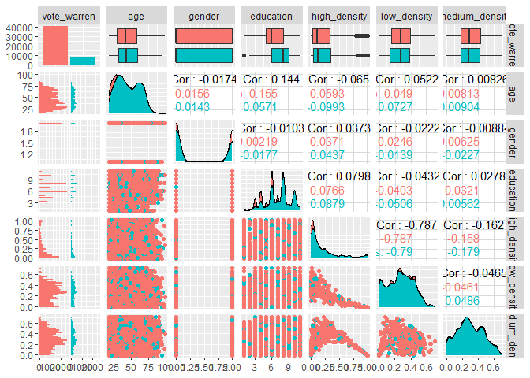<!-- -->

``` r
ggsave("vote_warren_ggpairs.png", height = 9/1.2, width = 16/1.2)
```

    ## `stat_bin()` using `bins = 30`. Pick better value with `binwidth`.
    ## `stat_bin()` using `bins = 30`. Pick better value with `binwidth`.
    ## `stat_bin()` using `bins = 30`. Pick better value with `binwidth`.
    ## `stat_bin()` using `bins = 30`. Pick better value with `binwidth`.
    ## `stat_bin()` using `bins = 30`. Pick better value with `binwidth`.
    ## `stat_bin()` using `bins = 30`. Pick better value with `binwidth`.

``` r
## second choice all candidates

second_choice <- tibble(c(1, 2, 3, 4, 7, 8, 9, 10, 11), 
                        c("Joe Biden", "Cory Booker", "Pete Buttigieg", "Julian Castro", 
                          "Bernie Sanders", "Elizabeth Warren", "Other", 
                          "Amy Klobuchar", "Mike Bloomberg"))

colnames(second_choice) <- c("rank_dems_2", "candidate_second_choice")

ns_sum %>%
    filter(rank_dems_2 != 888 & rank_dems_2 != 999 & !is.na(rank_dems_2)) %>%
    mutate(start_date = ymd(str_remove(start_date, "\\s.+"))) %>%
    left_join(second_choice) %>%
    group_by(start_date, candidate_second_choice) %>%
    summarize(second_pref = n()) %>%
    mutate(perc = second_pref / sum(second_pref)) %>%
    ggplot(aes(x = start_date, y = perc, color = candidate_second_choice, 
               group = candidate_second_choice)) + 
        geom_point() +
        geom_smooth(se = FALSE) +
        ylim(.1, .35)
```

    ## Joining, by = "rank_dems_2"

    ## `geom_smooth()` using method = 'loess' and formula 'y ~ x'

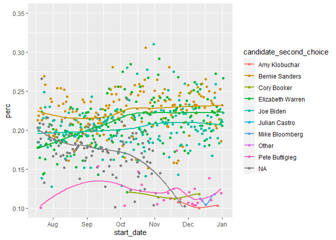<!-- -->

``` r
        ggtitle("Second Choice Candidate Preferences") +
        ggthemes::theme_fivethirtyeight()
```

    ## NULL

``` r
        ggsave("second_choice.png", height = 9/1.2, width = 16/1.2)
```

    ## `geom_smooth()` using method = 'loess' and formula 'y ~ x'

``` r
ns_sum %>%
    filter(rank_dems_1 != 888 & rank_dems_1 != 999 & !is.na(rank_dems_1) ) %>%
    mutate(start_date = ymd(str_remove(start_date, "\\s.+"))) %>%
    left_join(second_choice) %>%
    rename(candidate_first_choice = candidate_second_choice) %>%
    group_by(start_date, candidate_first_choice) %>%
    summarize(first_pref = n()) %>%
    mutate(perc = first_pref / sum(first_pref)) %>%
    filter(perc < .4) %>%
    ggplot(aes(x = start_date, y = perc, color = candidate_first_choice, 
               group = candidate_first_choice)) + 
        geom_point() +
        geom_smooth(se = FALSE) +
        ggtitle("First Choice Candidate Preferences") +
        scale_y_continuous(labels = scales::percent_format())
```

    ## Joining, by = "rank_dems_2"`geom_smooth()` using method = 'loess' and formula 'y ~ x'

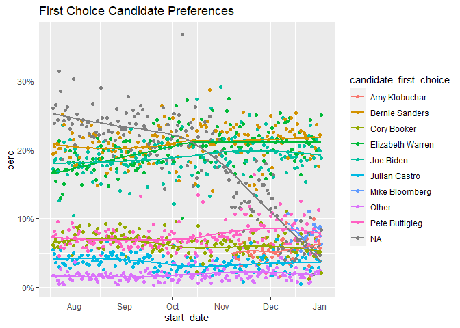<!-- -->

``` r
        ggsave("first_choice.png", height = 9/1.2, width = 16/1.2)        
```

    ## `geom_smooth()` using method = 'loess' and formula 'y ~ x'

``` r
ns_second_choice <- ns_sum %>%
    filter(rank_dems_2 != 888 & rank_dems_2 != 999 & !is.na(rank_dems_2)) %>%
    mutate(start_date = ymd(str_remove(start_date, "\\s.+"))) %>%
    left_join(second_choice) %>%
    group_by(start_date, candidate_second_choice) %>%
    summarize(second_pref = n()) %>%
    mutate(perc_second = second_pref / sum(second_pref)) %>%
    filter(candidate_second_choice == "Elizabeth Warren") %>%
    select(start_date, perc_second)
```

    ## Joining, by = "rank_dems_2"

``` r
ns_first_choice <- ns_sum %>%
    filter(rank_dems_1 != 888 & rank_dems_1 != 999 & !is.na(rank_dems_1)) %>%
    mutate(start_date = ymd(str_remove(start_date, "\\s.+"))) %>%
    left_join(second_choice) %>%
    rename(candidate_first_choice = candidate_second_choice) %>%
    group_by(start_date, candidate_first_choice) %>%
    summarize(first_pref = n()) %>%
    mutate(perc_first = first_pref / sum(first_pref)) %>%
    filter(candidate_first_choice == "Elizabeth Warren") %>%
    select(start_date, perc_first)
```

    ## Joining, by = "rank_dems_2"

``` r
ns_warren_intent2 <- ns_warren_intent %>%
    left_join(ns_first_choice, by = "start_date") %>%
    left_join(ns_second_choice, by = "start_date")

ns_warren_intent2 %>%
    pivot_longer(cols = 2:5, names_to = "stat", values_to = "values") %>%
    filter(stat != "warren_percent" & values < .4) %>%
    ggplot(aes(x = start_date, y = values, color = stat, group = stat)) +
        geom_point() +
        geom_smooth(se = FALSE) +
        theme_fivethirtyeight() +
        ggtitle("Voters Favoring Elizabeth Warren vs. Intending to Vote For Her") +
        scale_y_continuous(labels = scales::percent_format())
```

    ## `geom_smooth()` using method = 'loess' and formula 'y ~ x'

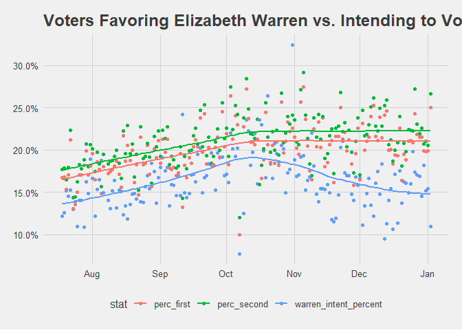<!-- -->

``` r
        ggsave("Warren_favor_intent.png", height = 9/1.2, width = 16/1.2)
```

    ## `geom_smooth()` using method = 'loess' and formula 'y ~ x'

  - Warren rose as Democratic voters’ first choice until plateauing in
    mid-October. Her percentage of voters who ranked Warren as their
    first choice did not decline as did her intent to vote. She was the
    first choice for the second-most Democratic primary voters, behind
    Sanders (Biden was third for much of the polling time period). Also
    notable was that the percentage of voters who listed “NA” declined
    rapidly after October. These trends were largely true also looking
    at voters’ second choices.
  - The third chart is also critical to understanding Warren’s campaign.
    She had a high percentage of first and second choices for voters,
    both of which rose until mid-October, then plateauing after. But the
    percentage of voters who intended to vote for her dramatically
    declined after October as opposed to just plateauing.
  - The ridgeline plot showing Biden, Sanders, and Warren support by age
    is interesting. Biden received fairly steady support among all ages,
    but with a slight increase among older voters. Sanders’s support is
    very clearly concentrated among younger voters. Warren’s support by
    age is bi-modal, with a peak of 30-ish supporters as well as older
    voters. This could explain a significant amount on its own, given
    that turnout is historically low for younger voters and higher for
    older voters.
  - The ggpairs plot also shows notable differnces for Warren supporters
    in age, education (Warren voters tended to be higher educated), and
    in cities (shown by the “higher density” variable from City Lab).

# Model building

This model is intended to predict whether a Democrat intended to vote
for Warren or not based on a variety of variable listed above,
including: interest in the election, intention to vote, favorable
opinion of Biden, favorable opinion of Sanders, indicators of racism,
indicators of sexism, employment stats, whether they were born in the
U.S. or abroad, union membership, age, gender, household income,
education level, and population density of their congressional district.

``` r
## Split data
set.seed(1234)

ns_split <- ns_select2 %>% # change this if decide to impute
    initial_split(prop = 0.8)

ns_train <- training(ns_split)
ns_train_cv <- vfold_cv(ns_train, strata = vote_warren)
ns_test <- testing(ns_split)

## Recipe
ns_rec <- recipe(vote_warren ~ ., data = ns_train) %>%
    step_corr(all_numeric()) %>%
    step_zv(all_numeric()) %>%
    step_normalize(all_numeric()) %>%
    #step_knnimpute(all_predictors()) %>%
    prep()

ns_rec
```

    ## Data Recipe
    ## 
    ## Inputs:
    ## 
    ##       role #variables
    ##    outcome          1
    ##  predictor         26
    ## 
    ## Training data contained 39038 data points and no missing data.
    ## 
    ## Operations:
    ## 
    ## Correlation filter removed no terms [trained]
    ## Zero variance filter removed no terms [trained]
    ## Centering and scaling for interest, ... [trained]

``` r
#ns_prep <- ns_rec %>% 
 #   prep()

ns_juiced <- ns_rec %>%
    juice()

## Model 1
library(tune)
rf_spec <- rand_forest(mode = "classification",
                       mtry = tune(),
                       trees = 1000,
                       min_n = tune()) %>%
    set_engine("ranger", importance = "impurity")

rf_grid <- tune_grid(
    ns_rec,
    model = rf_spec,
    resamples = ns_train_cv,
    control = control_resamples(save_pred = TRUE)
)
```

    ## i Creating pre-processing data to finalize unknown parameter: mtry

``` r
rf_grid %>%
    collect_metrics() 
```

    ## # A tibble: 20 x 7
    ##     mtry min_n .metric  .estimator  mean     n     std_err
    ##    <int> <int> <chr>    <chr>      <dbl> <int>       <dbl>
    ##  1     3    16 accuracy binary     0.876    10 0.000774   
    ##  2     3    16 roc_auc  binary     0.997    10 0.000161   
    ##  3     5    22 accuracy binary     0.877    10 0.000898   
    ##  4     5    22 roc_auc  binary     0.995    10 0.000234   
    ##  5     6    11 accuracy binary     0.930    10 0.000961   
    ##  6     6    11 roc_auc  binary     1.000    10 0.0000268  
    ##  7    11     8 accuracy binary     0.976    10 0.000751   
    ##  8    11     8 roc_auc  binary     1.000    10 0.00000621 
    ##  9    11    32 accuracy binary     0.876    10 0.000915   
    ## 10    11    32 roc_auc  binary     0.988    10 0.000330   
    ## 11    15    18 accuracy binary     0.911    10 0.000888   
    ## 12    15    18 roc_auc  binary     0.999    10 0.0000865  
    ## 13    18    40 accuracy binary     0.873    10 0.00106    
    ## 14    18    40 roc_auc  binary     0.980    10 0.000511   
    ## 15    21     6 accuracy binary     0.996    10 0.000328   
    ## 16    21     6 roc_auc  binary     1.000    10 0.000000573
    ## 17    23    26 accuracy binary     0.896    10 0.000794   
    ## 18    23    26 roc_auc  binary     0.995    10 0.000159   
    ## 19    24    33 accuracy binary     0.884    10 0.000707   
    ## 20    24    33 roc_auc  binary     0.989    10 0.000312

``` r
rf_grid %>%
    show_best("accuracy") 
```

    ## # A tibble: 5 x 7
    ##    mtry min_n .metric  .estimator  mean     n  std_err
    ##   <int> <int> <chr>    <chr>      <dbl> <int>    <dbl>
    ## 1    21     6 accuracy binary     0.996    10 0.000328
    ## 2    11     8 accuracy binary     0.976    10 0.000751
    ## 3     6    11 accuracy binary     0.930    10 0.000961
    ## 4    15    18 accuracy binary     0.911    10 0.000888
    ## 5    23    26 accuracy binary     0.896    10 0.000794

``` r
rf_best <- rf_grid %>%
    select_best(metric = "accuracy")

final_model_rf <- rf_spec %>%
    update(mtry = rf_best$mtry, min_n = rf_best$min_n) %>%
    fit(vote_warren ~ ., data = ns_juiced)

## Variable Importance
library(vip)
```

    ## Warning: package 'vip' was built under R version 3.6.3

    ## 
    ## Attaching package: 'vip'

    ## The following object is masked from 'package:utils':
    ## 
    ##     vi

``` r
final_model_rf %>%
    vip()
```

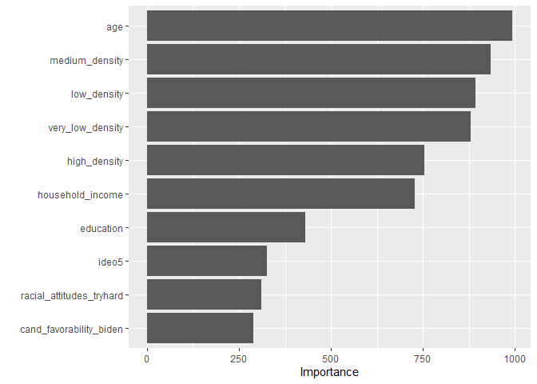<!-- -->

``` r
## Test data evaluation
final_model_rf %>%
    predict(new_data = bake(ns_rec, ns_test)) %>%
    mutate(truth = as.factor(ns_test$vote_warren)) %>%
    accuracy(truth, .pred_class)
```

    ## # A tibble: 1 x 3
    ##   .metric  .estimator .estimate
    ##   <chr>    <chr>          <dbl>
    ## 1 accuracy binary         0.835

The random forest model performed well on the test data, achieving
nearly 84% accuracy for classifying a poll respondent as supporting
Warren or not.

The variable important plot is interesting. Age was the most important
predictor, followed by all four population density variables and then
household income.

Age and income (and education) are not too surprising. While the
variable importance plot doesn’t tell us the direction of the effect on
supporting Warren, my *guess* is that medium density districts are more
supportive (wealthier suburbs), low and very low density districts are
less supportive, and high density districts are more supportive. But
this is something that could be corroborated by other data more analysis
of the Nationscape data.

This is helpful to both begin to understand the groups of voters who
might have supported Warren. Perry Bacon Jr.’s [analysis of why Warren’s
campaign didn’t win the
nomination](https://fivethirtyeight.com/features/why-warren-couldnt-win/)
illustrates the major point here:

> But she just never caught on with a broad swath of voters — polls
> suggest that she had little support outside of white college
> graduates. The New York Times described Warren as the candidate who
> often had the support of the “grass tops” rather than the grassroots —
> meaning that the leaders of activist groups often really liked Warren,
> but it’s not clear that the lower ranks did. For example, Warren won
> the personal endorsement of the president of the American Federation
> of Teachers, but the union itself wouldn’t endorse her because many of
> its members were with Biden or Sanders.

Beyond the demographics of her support, the sudden decline in polled
democrats supporting Warren in mid-October – despite steady favorability
ratings – suggests that attacks on her *perceived* electability were
really damaging. Enough people believed that electability would be a
concern for *other people* that they chose not to support her as their
top choice, despite still holding a favorable opinion of her as a
candidate. Some of her support from younger progressives likely went to
Bernie during that time, while some of her support from both older
voters and 30s-ish moderate voters was divided between candidates like
Mayor Pete, Amy Klobuchar, and Biden.

And no analysis of Warren’s (or any other female presidential
candidate’s) electability would be fair without recognizing the
deep-rooted sexism at the heart of such concerns. As one voter implied
(if I’m remembering the right podcast) on The Daily’s episode, [The
Field: What Happened to Elizabeth
Warren](https://www.nytimes.com/2020/03/10/podcasts/the-daily/warren.html),
it’s not personal sexism – it’s concern that *other* people are sexist
that hurt her support.
