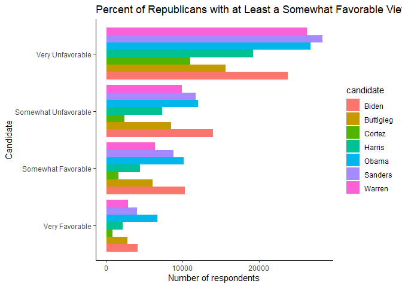
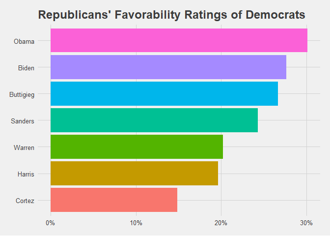
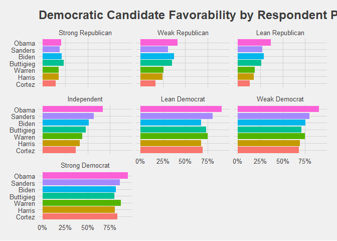
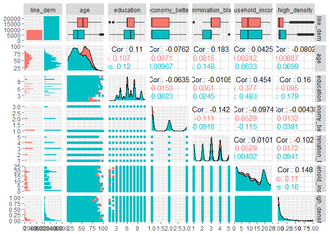
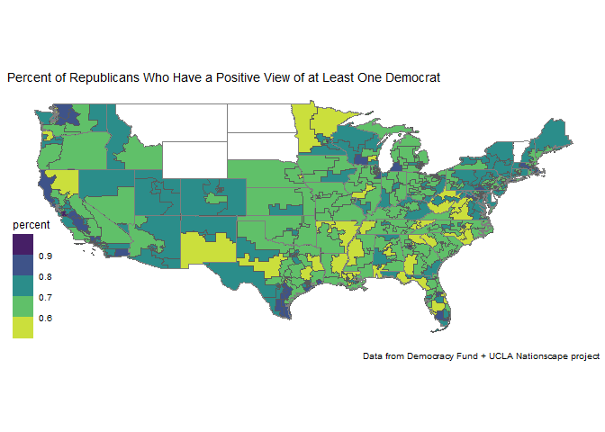
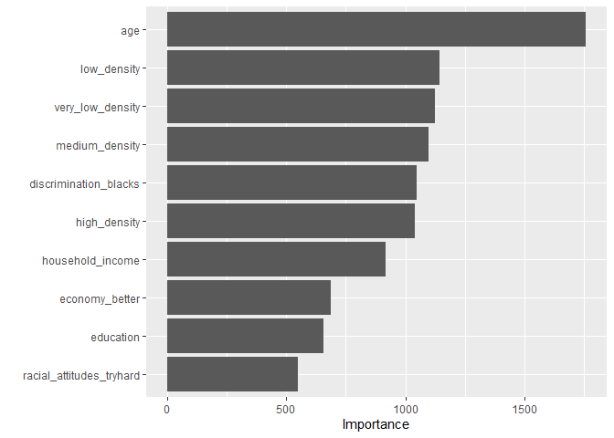
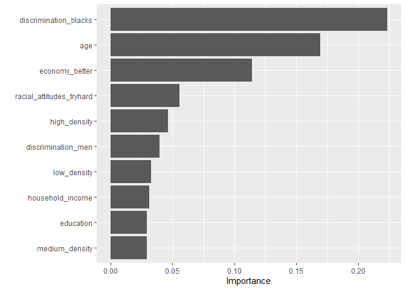

Who are the Republicans with Positive Views of Democrats
================
Chad Peltier
3/27/2020

One of the best books I’ve read recently was Ezra Klein’s *Why We’re
Polarized*, which is a deep dive into all of the political science (and
psychology, economics, sociology, etc.) research about political
polarization.

In the book he argues that political polarization has increased since
the mid 20th-century, and has increasingly been tied to most other
aspects of our identities. After the Dixiecrats largely left the
Democratic Party following the civil rights movement, the parties became
more internally homogenous and externally divided.

Obama-Trump voters are difficult to explain in the face of such intense
political polarization, which makes me wonder more broadly about
Republicans that currently hold favorable views of Democrats. Given the
2020 electoral importance of (1) long-time Democrats, many without
college degrees, who voted for Trump in 2016 and live in the Midwest,
and (2) [moderate suburban voters who flipped the House for Democrats
in 2018](https://fivethirtyeight.com/features/the-suburbs-all-kinds-of-suburbs-delivered-the-house-to-democrats/),
can we predict whether a self-identified Republican will have a
favorable view of a Democrat (any Democrat)?

Using the UCLA + Democracy Fund Nationscape data along with CityLab
population density data, we can start to answer these questions.

``` r
library(tidyverse)
```

    ## Warning: package 'ggplot2' was built under R version 3.6.3

    ## Warning: package 'dplyr' was built under R version 3.6.3

``` r
library(naniar)
```

    ## Warning: package 'naniar' was built under R version 3.6.2

``` r
library(tidymodels)
```

    ## Warning: package 'tidymodels' was built under R version 3.6.2

    ## Warning: package 'dials' was built under R version 3.6.2

    ## Warning: package 'infer' was built under R version 3.6.2

    ## Warning: package 'parsnip' was built under R version 3.6.2

    ## Warning: package 'recipes' was built under R version 3.6.2

    ## Warning: package 'rsample' was built under R version 3.6.2

    ## Warning: package 'yardstick' was built under R version 3.6.2

``` r
library(tune)
library(sf)
```

    ## Warning: package 'sf' was built under R version 3.6.3

``` r
library(tigris)
```

    ## Warning: package 'tigris' was built under R version 3.6.2

``` r
library(tidycensus)
```

    ## Warning: package 'tidycensus' was built under R version 3.6.2

``` r
library(vip)
```

    ## Warning: package 'vip' was built under R version 3.6.3

``` r
library(GGally)
```

    ## Warning: package 'GGally' was built under R version 3.6.2

``` r
library(ggthemes)
library(xgboost)
```

    ## Warning: package 'xgboost' was built under R version 3.6.3

``` r
library(ranger)
```

    ## Warning: package 'ranger' was built under R version 3.6.2

``` r
library(nnet)
```

Let’s start with some exploratory data analysis. We’ll make three charts
here:

  - Republicans’ favorability ratings of 7 Democrats (five who
    campaigned for the 2020 Democratic nomination, plus President Obama
    and Alexandria Ocasio Cortez) grouped by favorability rating (a
    four-level scale from very unfavorable to very favorable).
  - Republicans’ favorability ratings of Democrats (ungrouped)
  - Candidate favorability by respondent party ID

<!-- end list -->

``` r
ns_sum <- read_csv("ns_sum.csv")
```

    ## Warning: Missing column names filled in: 'X1' [1]

    ## Parsed with column specification:
    ## cols(
    ##   .default = col_double(),
    ##   response_id = col_character(),
    ##   start_date = col_datetime(format = ""),
    ##   news_sources_other_TEXT = col_character(),
    ##   vote_2016_other_text = col_character(),
    ##   employment_other_text = col_character(),
    ##   religion_other_text = col_character(),
    ##   state = col_character(),
    ##   congress_district = col_character(),
    ##   environment = col_logical(),
    ##   extra_ban_discr_race = col_logical(),
    ##   extra_ban_discr_gend = col_logical(),
    ##   extra_ban_discr_age = col_logical(),
    ##   extra_women_juries = col_logical(),
    ##   extra_driver_insure = col_logical(),
    ##   extra_helmet_moto = col_logical(),
    ##   extra_tax_cigarettes = col_logical(),
    ##   extra_school_silence = col_logical(),
    ##   extra_ban_corp_pun = col_logical(),
    ##   rep_vote_prim_TEXT = col_logical(),
    ##   rep_vote_prim = col_logical()
    ##   # ... with 140 more columns
    ## )

    ## See spec(...) for full column specifications.

    ## Warning: 5922379 parsing failures.
    ##  row                  col           expected actual         file
    ## 6584 environment          1/0/T/F/TRUE/FALSE    999 'ns_sum.csv'
    ## 6584 extra_ban_discr_gend 1/0/T/F/TRUE/FALSE    2   'ns_sum.csv'
    ## 6585 extra_ban_discr_gend 1/0/T/F/TRUE/FALSE    2   'ns_sum.csv'
    ## 6586 environment          1/0/T/F/TRUE/FALSE    888 'ns_sum.csv'
    ## 6587 environment          1/0/T/F/TRUE/FALSE    888 'ns_sum.csv'
    ## .... .................... .................. ...... ............
    ## See problems(...) for more details.

``` r
## Only repubs - % by favorability
ns_sum %>%
    filter(pid7 > 4) %>%
    select(starts_with("cand_fav"), 
           -cand_favorability_pence, - cand_favorability_trump) %>%
    pivot_longer(cols = starts_with("cand_fav"),names_to = "candidate", 
                 values_to = "favorability") %>%
    mutate(candidate = str_to_title(str_remove_all(candidate, "cand_favorability_"))) %>%
    group_by(candidate, favorability) %>%
    summarize(n = n()) %>%
    filter(favorability != 999 & !is.na(favorability)) %>%
    mutate(favorability = if_else(favorability == 1, "Very Favorable",
                            if_else(favorability == 2, "Somewhat Favorable",
                              if_else(favorability == 3 , "Somewhat Unfavorable", 
                                if_else(favorability == 4, "Very Unfavorable", "other")
                                )))) %>%
    ggplot(aes(x = reorder(favorability, n), y = n, fill = candidate)) +
        geom_col(position = "dodge") +
        coord_flip() +
        ggtitle("Percent of Republicans with at Least a Somewhat Favorable View of Democrats") +
        theme_classic() +
        xlab("Candidate") +
        ylab("Number of respondents")
```

<!-- -->

``` r
        ggsave("repubs_dems_fav1.png", heigh = 9/1.2, width = 16/1.2)


## Only repubs - % favorability
ns_sum %>%
    filter(pid7 > 4) %>%
    select(starts_with("cand_fav"), 
           -cand_favorability_pence, - cand_favorability_trump) %>%
    pivot_longer(cols = starts_with("cand_fav"),names_to = "candidate", 
                 values_to = "favorability") %>%
    mutate(candidate = str_to_title(str_remove_all(candidate, "cand_favorability_"))) %>%
    group_by(candidate, favorability) %>%
    summarize(n = n()) %>%
    filter(favorability != 999 & !is.na(favorability)) %>%
    group_by(candidate) %>%
    summarize(percent_favorable = sum(n[favorability == 1 | favorability == 2]) /
                  sum(n)) %>%
    mutate(candidate = fct_reorder(candidate, percent_favorable)) %>%
      ggplot(aes(x = candidate, y = percent_favorable, fill = candidate)) +
        geom_col(show.legend = FALSE) +
        coord_flip() +
        scale_y_continuous(labels = scales::percent_format()) +
        ggtitle("Republicans' Favorability Ratings of Democrats") +
        ggthemes::theme_fivethirtyeight()
```

<!-- -->

``` r
        ggsave("repubs_dems_fav2.png", heigh = 9/1.2, width = 16/1.2)


## All party IDs
table(ns_sum$pid7)
```

    ## 
    ##     1     2     3     4     5     6     7 
    ## 33134 21036 14547 18329 12343 17909 27786

``` r
fav_by_party <- ns_sum %>%
    #filter(pid7 > 4) %>%
    select(pid7, starts_with("cand_fav"), 
           -cand_favorability_pence, - cand_favorability_trump) %>%
    mutate(pid7 = as.factor(if_else(pid7 == 1, "Strong Democrat", if_else(pid7 == 2, 
                    "Weak Democrat",
                    if_else(pid7 == 3, "Lean Democrat", if_else(pid7 == 4, "Independent",
                      if_else(pid7 == 5, "Lean Republican", if_else(pid7 == 6, 
                        "Weak Republican", if_else(pid7 == 7, "Strong Republican", 
                          "Skipped"))))))))) %>%
    filter(pid7 != "Skipped") %>%
    pivot_longer(cols = starts_with("cand_fav"),names_to = "candidate", 
                 values_to = "favorability") %>%
    mutate(candidate = str_to_title(str_remove_all(candidate, "cand_favorability_"))) %>%
    group_by(pid7, candidate, favorability) %>%
    summarize(n = n()) %>%
    filter(favorability != 999 & !is.na(favorability)) %>%
    group_by(pid7, candidate) %>%
    summarize(percent_favorable = sum(n[favorability == 1 | favorability == 2]) /
                  sum(n))

fav_by_party$pid7 <- factor(fav_by_party$pid7, levels = c("Strong Republican",
                              "Weak Republican", "Lean Republican", "Independent",
                              "Lean Democrat", "Weak Democrat", "Strong Democrat"))

fav_by_party %>%
    mutate(candidate = fct_reorder(candidate, percent_favorable)) %>%
      ggplot(aes(x = candidate, y = percent_favorable, fill = candidate)) +
        geom_col(show.legend = FALSE) +
        coord_flip() +
        scale_y_continuous(labels = scales::percent_format()) +
        ggthemes::theme_fivethirtyeight() +
        facet_wrap(~ pid7) +
        ggtitle("Democratic Candidate Favorability by Respondent Party") +
        ggsave("repubs_dems_fav3.png", heigh = 9/1.2, width = 16/1.2)
```

<!-- -->

The results are pretty interesting. Of Republican (those who identify as
either “lean”, “somewhat”, or “strong” Republicans) respondents who had
an opinion of the candidates, Sanders had the most unfavorables, but was
second or third in the number of respondents with somewhat favorable of
very favorable. It’s possible that the “Very Unfavorable” ratings are
most influenced by name recognition, as the most unfavorably-viewed
candidates are also the most well known: Sanders, Warren, Obama, and
Biden. Interestingly, Obama and Biden lead the way with somewhat
favorable and very favorable ratings.

Removing the grouping by favorability, the above trends become a little
more clear. Obama and Biden again lead with the greatest percentage of
Republicans with a favorable view. But most strikingly,the largest
drop-off isn’t by candidate ideology, but by candidate gender: the three
female Democratic candidates asked about in the Nationscape data also
have the lowest favorability ratings among Republicans.

Segmenting the data by respondent party identification, Obama, Biden,
and Buttigieg tend to have the highest favorability ratings from
Republicans. Interestingly, Elizabeth Warren’s greatest support comes
from respondents who identify as strong Democrats.

# Data prep

Next we’ll prep and clean a smaller version of the Nationscape data for
modeling, joining it with the CityLab density data, which is by
Congressional district. We’re going to try and predict whether a
Republican will hold a favorable view of any Democrat or whether they
dislike all of the seven candidates polled in the survey.

``` r
repub_views <- ns_sum %>%
    filter(pid7 > 4) %>%
    select(interest, vote_intention, racial_attitudes_tryhard, cand_favorability_obama,
           cand_favorability_biden, cand_favorability_buttigieg, cand_favorability_cortez,
           cand_favorability_harris, cand_favorability_sanders, cand_favorability_warren,
           gender_attitudes_maleboss, gender_attitudes_logical, economy_better, religion, 
           is_evangelical, gender_attitudes_opportunity, gender_attitudes_complain,
           discrimination_blacks,
           discrimination_men, discrimination_women, employment, foreign_born, in_union, 
           age, gender, household_income, education, congress_district) %>%
    mutate(student = if_else(employment == 7, 1, 0),
           full_time = if_else(employment == 1, 1, 0),
           unemployed = if_else(employment == 4, 1, 0),
           cand_favorability_obama = if_else(cand_favorability_obama < 3, 1, 0),
           cand_favorability_biden = if_else(cand_favorability_biden < 3 , 1, 0),
           cand_favorability_buttigieg = if_else(cand_favorability_buttigieg < 3 , 1, 0),
           cand_favorability_harris = if_else(cand_favorability_harris < 3 , 1, 0),
           cand_favorability_warren = if_else(cand_favorability_warren < 3 , 1, 0),
           cand_favorability_cortez = if_else(cand_favorability_cortez < 3 , 1, 0),
           cand_favorability_sanders = if_else(cand_favorability_sanders < 3 , 1, 0),
           protestant = if_else(religion == 1, 1, 0),
           agn_atheist = if_else(religion == 10 | religion == 11, 1, 0)
           ) %>%
    select(-employment, -religion) %>%
    replace_with_na_all(condition = ~.x == "888") %>%
    replace_with_na_all(condition = ~.x == "999")


## Add in citylab data
citylab <- read_csv("citylab.csv")
```

    ## Parsed with column specification:
    ## cols(
    ##   CD = col_character(),
    ##   Cluster = col_character(),
    ##   `Very low density` = col_double(),
    ##   `Low density` = col_double(),
    ##   `Medium density` = col_double(),
    ##   `High density` = col_double()
    ## )

``` r
citylab <- citylab %>%
    janitor::clean_names() %>%
    mutate(cd = str_remove(cd, "-"),
           cd = if_else(cd == "AKAL", "AK00", cd))

repub_views <- repub_views %>%
    inner_join(citylab, by = c("congress_district" = "cd")) %>%
    mutate(like_dem = as.factor(if_else(cand_favorability_obama == 1 | 
                                cand_favorability_biden ==1|
                        cand_favorability_buttigieg == 1 | 
                          cand_favorability_harris == 1 |
                          cand_favorability_warren == 1 | 
                          cand_favorability_cortez == 1 |
                          cand_favorability_sanders == 1, "yes", "no")))

repub_views2 <- repub_views %>%
    select(-congress_district, -cluster, -cand_favorability_obama,
           -cand_favorability_biden, -cand_favorability_buttigieg,
           -cand_favorability_cortez, -cand_favorability_harris,
           -cand_favorability_sanders, - cand_favorability_warren) %>% 
    drop_na() 
```

# Explore data

With the filtered data we can do a few more exploratory data plots,
including a summary plot of relationships between a lot of the
variables.

``` r
table(repub_views2$like_dem)
```

    ## 
    ##    no   yes 
    ##  9459 21724

``` r
skimr::skim(repub_views2)
```

|                                                  |               |
| :----------------------------------------------- | :------------ |
| Name                                             | repub\_views2 |
| Number of rows                                   | 31183         |
| Number of columns                                | 28            |
| \_\_\_\_\_\_\_\_\_\_\_\_\_\_\_\_\_\_\_\_\_\_\_   |               |
| Column type frequency:                           |               |
| factor                                           | 1             |
| numeric                                          | 27            |
| \_\_\_\_\_\_\_\_\_\_\_\_\_\_\_\_\_\_\_\_\_\_\_\_ |               |
| Group variables                                  | None          |

Data summary

**Variable type: factor**

| skim\_variable | n\_missing | complete\_rate | ordered | n\_unique | top\_counts          |
| :------------- | ---------: | -------------: | :------ | --------: | :------------------- |
| like\_dem      |          0 |              1 | FALSE   |         2 | yes: 21724, no: 9459 |

**Variable type: numeric**

| skim\_variable                 | n\_missing | complete\_rate |  mean |    sd | p0 |   p25 |   p50 |   p75 |  p100 | hist  |
| :----------------------------- | ---------: | -------------: | ----: | ----: | -: | ----: | ----: | ----: | ----: | :---- |
| interest                       |          0 |              1 |  1.74 |  0.81 |  1 |  1.00 |  2.00 |  2.00 |  4.00 | ▇▇▁▂▁ |
| vote\_intention                |          0 |              1 |  1.09 |  0.35 |  1 |  1.00 |  1.00 |  1.00 |  3.00 | ▇▁▁▁▁ |
| racial\_attitudes\_tryhard     |          0 |              1 |  2.02 |  1.11 |  1 |  1.00 |  2.00 |  3.00 |  5.00 | ▇▆▃▁▁ |
| gender\_attitudes\_maleboss    |          0 |              1 |  3.02 |  1.16 |  1 |  2.00 |  3.00 |  4.00 |  5.00 | ▂▂▇▂▂ |
| gender\_attitudes\_logical     |          0 |              1 |  1.64 |  0.95 |  1 |  1.00 |  1.00 |  2.00 |  5.00 | ▇▃▂▁▁ |
| economy\_better                |          0 |              1 |  1.49 |  0.65 |  1 |  1.00 |  1.00 |  2.00 |  3.00 | ▇▁▅▁▁ |
| is\_evangelical                |          0 |              1 |  1.60 |  0.49 |  1 |  1.00 |  2.00 |  2.00 |  2.00 | ▅▁▁▁▇ |
| gender\_attitudes\_opportunity |          0 |              1 |  2.00 |  0.97 |  1 |  1.00 |  2.00 |  3.00 |  5.00 | ▇▇▅▁▁ |
| gender\_attitudes\_complain    |          0 |              1 |  2.94 |  1.27 |  1 |  2.00 |  3.00 |  4.00 |  5.00 | ▅▇▇▅▅ |
| discrimination\_blacks         |          0 |              1 |  2.77 |  1.15 |  1 |  2.00 |  3.00 |  4.00 |  5.00 | ▅▅▇▆▁ |
| discrimination\_men            |          0 |              1 |  3.43 |  1.23 |  1 |  3.00 |  4.00 |  4.00 |  5.00 | ▂▃▆▇▅ |
| discrimination\_women          |          0 |              1 |  3.03 |  1.11 |  1 |  2.00 |  3.00 |  4.00 |  5.00 | ▂▃▇▆▂ |
| foreign\_born                  |          0 |              1 |  1.05 |  0.22 |  1 |  1.00 |  1.00 |  1.00 |  2.00 | ▇▁▁▁▁ |
| in\_union                      |          0 |              1 |  2.68 |  0.64 |  1 |  3.00 |  3.00 |  3.00 |  3.00 | ▁▁▂▁▇ |
| age                            |          0 |              1 | 46.12 | 16.11 | 18 | 33.00 | 45.00 | 59.00 | 99.00 | ▇▇▇▃▁ |
| gender                         |          0 |              1 |  1.54 |  0.50 |  1 |  1.00 |  2.00 |  2.00 |  2.00 | ▇▁▁▁▇ |
| household\_income              |          0 |              1 | 10.55 |  7.06 |  1 |  4.00 |  9.00 | 18.00 | 24.00 | ▇▆▃▅▃ |
| education                      |          0 |              1 |  6.68 |  2.15 |  1 |  5.00 |  7.00 |  8.00 | 11.00 | ▂▅▇▆▃ |
| student                        |          0 |              1 |  0.03 |  0.18 |  0 |  0.00 |  0.00 |  0.00 |  1.00 | ▇▁▁▁▁ |
| full\_time                     |          0 |              1 |  0.46 |  0.50 |  0 |  0.00 |  0.00 |  1.00 |  1.00 | ▇▁▁▁▇ |
| unemployed                     |          0 |              1 |  0.05 |  0.22 |  0 |  0.00 |  0.00 |  0.00 |  1.00 | ▇▁▁▁▁ |
| protestant                     |          0 |              1 |  0.24 |  0.43 |  0 |  0.00 |  0.00 |  0.00 |  1.00 | ▇▁▁▁▂ |
| agn\_atheist                   |          0 |              1 |  0.05 |  0.22 |  0 |  0.00 |  0.00 |  0.00 |  1.00 | ▇▁▁▁▁ |
| very\_low\_density             |          0 |              1 |  0.25 |  0.22 |  0 |  0.05 |  0.22 |  0.42 |  0.89 | ▇▃▃▂▁ |
| low\_density                   |          0 |              1 |  0.30 |  0.15 |  0 |  0.21 |  0.31 |  0.41 |  0.70 | ▃▆▇▅▁ |
| medium\_density                |          0 |              1 |  0.28 |  0.16 |  0 |  0.16 |  0.26 |  0.41 |  0.70 | ▆▇▆▅▁ |
| high\_density                  |          0 |              1 |  0.16 |  0.23 |  0 |  0.01 |  0.06 |  0.21 |  1.00 | ▇▂▁▁▁ |

``` r
repub_ggpair <- repub_views2 %>%
    select(like_dem, age, education, economy_better, discrimination_blacks,
           household_income, high_density) %>%
    GGally::ggpairs(mapping = aes(color = like_dem))

print(repub_ggpair, progress = FALSE)
```

    ## Warning in ggmatrix_gtable(x, ...): Please use the 'progress' parameter in
    ## your ggmatrix-like function call. See ?ggmatrix_progress for a few examples.
    ## ggmatrix_gtable 'progress' and 'progress_format' will soon be deprecated.TRUE

    ## `stat_bin()` using `bins = 30`. Pick better value with `binwidth`.
    ## `stat_bin()` using `bins = 30`. Pick better value with `binwidth`.
    ## `stat_bin()` using `bins = 30`. Pick better value with `binwidth`.
    ## `stat_bin()` using `bins = 30`. Pick better value with `binwidth`.
    ## `stat_bin()` using `bins = 30`. Pick better value with `binwidth`.
    ## `stat_bin()` using `bins = 30`. Pick better value with `binwidth`.

<!-- -->

Notably, Republicans who hold a favorable opinion of at least one
Democrat appear to live in higher density congressional districts, have
a wider range of education and income levels, and be younger than those
who dislike all Democrats.

``` r
ga_cd <- congressional_districts(class = "sf", cb = TRUE, resolution = "20m")
```

    ## 
    Downloading: 16 kB     
    Downloading: 16 kB     
    Downloading: 25 kB     
    Downloading: 25 kB     
    Downloading: 25 kB     
    Downloading: 25 kB     
    Downloading: 41 kB     
    Downloading: 41 kB     
    Downloading: 49 kB     
    Downloading: 49 kB     
    Downloading: 49 kB     
    Downloading: 49 kB     
    Downloading: 49 kB     
    Downloading: 49 kB     
    Downloading: 57 kB     
    Downloading: 57 kB     
    Downloading: 57 kB     
    Downloading: 57 kB     
    Downloading: 57 kB     
    Downloading: 57 kB     
    Downloading: 65 kB     
    Downloading: 65 kB     
    Downloading: 65 kB     
    Downloading: 65 kB     
    Downloading: 65 kB     
    Downloading: 65 kB     
    Downloading: 73 kB     
    Downloading: 73 kB     
    Downloading: 73 kB     
    Downloading: 73 kB     
    Downloading: 73 kB     
    Downloading: 73 kB     
    Downloading: 73 kB     
    Downloading: 73 kB     
    Downloading: 89 kB     
    Downloading: 89 kB     
    Downloading: 89 kB     
    Downloading: 89 kB     
    Downloading: 110 kB     
    Downloading: 110 kB     
    Downloading: 110 kB     
    Downloading: 110 kB     
    Downloading: 110 kB     
    Downloading: 110 kB     
    Downloading: 110 kB     
    Downloading: 110 kB     
    Downloading: 110 kB     
    Downloading: 110 kB     
    Downloading: 120 kB     
    Downloading: 120 kB     
    Downloading: 120 kB     
    Downloading: 120 kB     
    Downloading: 120 kB     
    Downloading: 120 kB     
    Downloading: 130 kB     
    Downloading: 130 kB     
    Downloading: 130 kB     
    Downloading: 130 kB     
    Downloading: 130 kB     
    Downloading: 130 kB     
    Downloading: 150 kB     
    Downloading: 150 kB     
    Downloading: 150 kB     
    Downloading: 150 kB     
    Downloading: 150 kB     
    Downloading: 150 kB     
    Downloading: 150 kB     
    Downloading: 150 kB     
    Downloading: 170 kB     
    Downloading: 170 kB     
    Downloading: 180 kB     
    Downloading: 180 kB     
    Downloading: 180 kB     
    Downloading: 180 kB     
    Downloading: 190 kB     
    Downloading: 190 kB     
    Downloading: 190 kB     
    Downloading: 190 kB     
    Downloading: 190 kB     
    Downloading: 190 kB     
    Downloading: 190 kB     
    Downloading: 190 kB     
    Downloading: 190 kB     
    Downloading: 190 kB     
    Downloading: 210 kB     
    Downloading: 210 kB     
    Downloading: 210 kB     
    Downloading: 210 kB     
    Downloading: 220 kB     
    Downloading: 220 kB     
    Downloading: 220 kB     
    Downloading: 220 kB     
    Downloading: 220 kB     
    Downloading: 220 kB     
    Downloading: 230 kB     
    Downloading: 230 kB     
    Downloading: 230 kB     
    Downloading: 230 kB     
    Downloading: 230 kB     
    Downloading: 230 kB     
    Downloading: 230 kB     
    Downloading: 230 kB     
    Downloading: 240 kB     
    Downloading: 240 kB     
    Downloading: 240 kB     
    Downloading: 240 kB     
    Downloading: 240 kB     
    Downloading: 240 kB     
    Downloading: 250 kB     
    Downloading: 250 kB     
    Downloading: 250 kB     
    Downloading: 250 kB     
    Downloading: 260 kB     
    Downloading: 260 kB     
    Downloading: 260 kB     
    Downloading: 260 kB     
    Downloading: 260 kB     
    Downloading: 260 kB     
    Downloading: 270 kB     
    Downloading: 270 kB     
    Downloading: 270 kB     
    Downloading: 270 kB     
    Downloading: 280 kB     
    Downloading: 280 kB     
    Downloading: 280 kB     
    Downloading: 280 kB     
    Downloading: 280 kB     
    Downloading: 280 kB     
    Downloading: 280 kB     
    Downloading: 280 kB     
    Downloading: 290 kB     
    Downloading: 290 kB     
    Downloading: 300 kB     
    Downloading: 300 kB     
    Downloading: 300 kB     
    Downloading: 300 kB     
    Downloading: 310 kB     
    Downloading: 310 kB     
    Downloading: 320 kB     
    Downloading: 320 kB     
    Downloading: 320 kB     
    Downloading: 320 kB     
    Downloading: 330 kB     
    Downloading: 330 kB     
    Downloading: 330 kB     
    Downloading: 330 kB     
    Downloading: 330 kB     
    Downloading: 330 kB     
    Downloading: 330 kB     
    Downloading: 330 kB     
    Downloading: 330 kB     
    Downloading: 330 kB     
    Downloading: 330 kB     
    Downloading: 330 kB     
    Downloading: 330 kB     
    Downloading: 330 kB     
    Downloading: 340 kB     
    Downloading: 340 kB     
    Downloading: 340 kB     
    Downloading: 340 kB     
    Downloading: 340 kB     
    Downloading: 340 kB     
    Downloading: 340 kB     
    Downloading: 340 kB     
    Downloading: 350 kB     
    Downloading: 350 kB     
    Downloading: 350 kB     
    Downloading: 350 kB     
    Downloading: 350 kB     
    Downloading: 350 kB     
    Downloading: 360 kB     
    Downloading: 360 kB     
    Downloading: 360 kB     
    Downloading: 360 kB     
    Downloading: 360 kB     
    Downloading: 360 kB     
    Downloading: 370 kB     
    Downloading: 370 kB     
    Downloading: 370 kB     
    Downloading: 370 kB     
    Downloading: 390 kB     
    Downloading: 390 kB     
    Downloading: 390 kB     
    Downloading: 390 kB     
    Downloading: 390 kB     
    Downloading: 390 kB     
    Downloading: 410 kB     
    Downloading: 410 kB     
    Downloading: 410 kB     
    Downloading: 410 kB

``` r
states <- tigris::states()
```

    ## 
      |                                                                            
      |                                                                      |   0%
      |                                                                            
      |                                                                      |   1%
      |                                                                            
      |=                                                                     |   1%
      |                                                                            
      |=                                                                     |   2%
      |                                                                            
      |==                                                                    |   2%
      |                                                                            
      |==                                                                    |   3%
      |                                                                            
      |==                                                                    |   4%
      |                                                                            
      |===                                                                   |   4%
      |                                                                            
      |===                                                                   |   5%
      |                                                                            
      |====                                                                  |   5%
      |                                                                            
      |====                                                                  |   6%
      |                                                                            
      |=====                                                                 |   7%
      |                                                                            
      |=====                                                                 |   8%
      |                                                                            
      |======                                                                |   8%
      |                                                                            
      |======                                                                |   9%
      |                                                                            
      |=======                                                               |   9%
      |                                                                            
      |=======                                                               |  10%
      |                                                                            
      |=======                                                               |  11%
      |                                                                            
      |========                                                              |  11%
      |                                                                            
      |========                                                              |  12%
      |                                                                            
      |=========                                                             |  12%
      |                                                                            
      |=========                                                             |  13%
      |                                                                            
      |=========                                                             |  14%
      |                                                                            
      |==========                                                            |  14%
      |                                                                            
      |==========                                                            |  15%
      |                                                                            
      |===========                                                           |  15%
      |                                                                            
      |===========                                                           |  16%
      |                                                                            
      |============                                                          |  16%
      |                                                                            
      |============                                                          |  17%
      |                                                                            
      |============                                                          |  18%
      |                                                                            
      |=============                                                         |  18%
      |                                                                            
      |=============                                                         |  19%
      |                                                                            
      |==============                                                        |  19%
      |                                                                            
      |==============                                                        |  20%
      |                                                                            
      |==============                                                        |  21%
      |                                                                            
      |===============                                                       |  21%
      |                                                                            
      |===============                                                       |  22%
      |                                                                            
      |================                                                      |  22%
      |                                                                            
      |================                                                      |  23%
      |                                                                            
      |=================                                                     |  24%
      |                                                                            
      |=================                                                     |  25%
      |                                                                            
      |==================                                                    |  25%
      |                                                                            
      |==================                                                    |  26%
      |                                                                            
      |===================                                                   |  26%
      |                                                                            
      |===================                                                   |  27%
      |                                                                            
      |===================                                                   |  28%
      |                                                                            
      |====================                                                  |  28%
      |                                                                            
      |====================                                                  |  29%
      |                                                                            
      |=====================                                                 |  29%
      |                                                                            
      |=====================                                                 |  30%
      |                                                                            
      |=====================                                                 |  31%
      |                                                                            
      |======================                                                |  31%
      |                                                                            
      |======================                                                |  32%
      |                                                                            
      |=======================                                               |  32%
      |                                                                            
      |=======================                                               |  33%
      |                                                                            
      |=======================                                               |  34%
      |                                                                            
      |========================                                              |  34%
      |                                                                            
      |========================                                              |  35%
      |                                                                            
      |=========================                                             |  35%
      |                                                                            
      |=========================                                             |  36%
      |                                                                            
      |==========================                                            |  37%
      |                                                                            
      |==========================                                            |  38%
      |                                                                            
      |===========================                                           |  38%
      |                                                                            
      |===========================                                           |  39%
      |                                                                            
      |============================                                          |  39%
      |                                                                            
      |============================                                          |  40%
      |                                                                            
      |============================                                          |  41%
      |                                                                            
      |=============================                                         |  41%
      |                                                                            
      |=============================                                         |  42%
      |                                                                            
      |==============================                                        |  42%
      |                                                                            
      |==============================                                        |  43%
      |                                                                            
      |===============================                                       |  44%
      |                                                                            
      |===============================                                       |  45%
      |                                                                            
      |================================                                      |  45%
      |                                                                            
      |================================                                      |  46%
      |                                                                            
      |=================================                                     |  46%
      |                                                                            
      |=================================                                     |  47%
      |                                                                            
      |=================================                                     |  48%
      |                                                                            
      |==================================                                    |  48%
      |                                                                            
      |==================================                                    |  49%
      |                                                                            
      |===================================                                   |  49%
      |                                                                            
      |===================================                                   |  50%
      |                                                                            
      |===================================                                   |  51%
      |                                                                            
      |====================================                                  |  51%
      |                                                                            
      |====================================                                  |  52%
      |                                                                            
      |=====================================                                 |  52%
      |                                                                            
      |=====================================                                 |  53%
      |                                                                            
      |======================================                                |  54%
      |                                                                            
      |======================================                                |  55%
      |                                                                            
      |=======================================                               |  55%
      |                                                                            
      |=======================================                               |  56%
      |                                                                            
      |========================================                              |  57%
      |                                                                            
      |========================================                              |  58%
      |                                                                            
      |=========================================                             |  58%
      |                                                                            
      |=========================================                             |  59%
      |                                                                            
      |==========================================                            |  59%
      |                                                                            
      |==========================================                            |  60%
      |                                                                            
      |==========================================                            |  61%
      |                                                                            
      |===========================================                           |  61%
      |                                                                            
      |===========================================                           |  62%
      |                                                                            
      |============================================                          |  62%
      |                                                                            
      |============================================                          |  63%
      |                                                                            
      |=============================================                         |  64%
      |                                                                            
      |=============================================                         |  65%
      |                                                                            
      |==============================================                        |  65%
      |                                                                            
      |==============================================                        |  66%
      |                                                                            
      |===============================================                       |  66%
      |                                                                            
      |===============================================                       |  67%
      |                                                                            
      |===============================================                       |  68%
      |                                                                            
      |================================================                      |  68%
      |                                                                            
      |================================================                      |  69%
      |                                                                            
      |=================================================                     |  69%
      |                                                                            
      |=================================================                     |  70%
      |                                                                            
      |=================================================                     |  71%
      |                                                                            
      |==================================================                    |  71%
      |                                                                            
      |==================================================                    |  72%
      |                                                                            
      |===================================================                   |  72%
      |                                                                            
      |===================================================                   |  73%
      |                                                                            
      |===================================================                   |  74%
      |                                                                            
      |====================================================                  |  74%
      |                                                                            
      |====================================================                  |  75%
      |                                                                            
      |=====================================================                 |  75%
      |                                                                            
      |=====================================================                 |  76%
      |                                                                            
      |======================================================                |  77%
      |                                                                            
      |======================================================                |  78%
      |                                                                            
      |=======================================================               |  78%
      |                                                                            
      |=======================================================               |  79%
      |                                                                            
      |========================================================              |  79%
      |                                                                            
      |========================================================              |  80%
      |                                                                            
      |========================================================              |  81%
      |                                                                            
      |=========================================================             |  81%
      |                                                                            
      |=========================================================             |  82%
      |                                                                            
      |==========================================================            |  82%
      |                                                                            
      |==========================================================            |  83%
      |                                                                            
      |==========================================================            |  84%
      |                                                                            
      |===========================================================           |  84%
      |                                                                            
      |===========================================================           |  85%
      |                                                                            
      |============================================================          |  85%
      |                                                                            
      |============================================================          |  86%
      |                                                                            
      |=============================================================         |  86%
      |                                                                            
      |=============================================================         |  87%
      |                                                                            
      |=============================================================         |  88%
      |                                                                            
      |==============================================================        |  88%
      |                                                                            
      |==============================================================        |  89%
      |                                                                            
      |===============================================================       |  89%
      |                                                                            
      |===============================================================       |  90%
      |                                                                            
      |===============================================================       |  91%
      |                                                                            
      |================================================================      |  91%
      |                                                                            
      |================================================================      |  92%
      |                                                                            
      |=================================================================     |  92%
      |                                                                            
      |=================================================================     |  93%
      |                                                                            
      |=================================================================     |  94%
      |                                                                            
      |==================================================================    |  94%
      |                                                                            
      |==================================================================    |  95%
      |                                                                            
      |===================================================================   |  95%
      |                                                                            
      |===================================================================   |  96%
      |                                                                            
      |====================================================================  |  97%
      |                                                                            
      |====================================================================  |  98%
      |                                                                            
      |===================================================================== |  98%
      |                                                                            
      |===================================================================== |  99%
      |                                                                            
      |======================================================================|  99%
      |                                                                            
      |======================================================================| 100%

``` r
states <- states@data 
states <- states %>%
    select(STATEFP, NAME)

ga_cd <- ga_cd %>% 
    left_join(states, by = "STATEFP")

state_abb <- state.abb %>%
    tibble() %>%
    cbind(state.name) %>%
    rename(state_abb = 1)

ga_cd <- ga_cd %>% 
    left_join(state_abb, by = c("NAME" = "state.name"))
```

    ## Warning: Column `NAME`/`state.name` joining character vector and factor,
    ## coercing into character vector

``` r
ga_cd <- ga_cd %>%
    unite(col = congress_district, state_abb, CD115FP, sep = "")


repub_like_dem <- repub_views %>%
    inner_join(ga_cd, by = "congress_district")

repub_like_dem %>%
    filter(!is.na(like_dem)) %>%
    group_by(congress_district, like_dem) %>%
    summarise(n = n()) %>%
    group_by(congress_district) %>%
    summarise(percent = sum(n[like_dem == "yes"])/sum(n)) %>%
    left_join(ga_cd, by = "congress_district") %>%
    filter(!str_detect(congress_district, "HI") & !str_detect(congress_district, "AK")) %>%
    ggplot(aes(fill = percent)) +
        geom_sf(aes(geometry = geometry)) +
        borders("state")+
        ggthemes::theme_map() +
        ggtitle("Percent of Republicans Who Have a Positive View of at Least One Democrat") +
        labs(caption = "Data from Democracy Fund + UCLA Nationscape project") +
        #scale_fill_viridis(direction = -1) +
        scale_fill_binned(type = "viridis", direction = -1)
```

<!-- -->

``` r
ggsave("ns_repub_likedem.png", width = 16/1.2, height = 9/1.2)
```

Mapping out the above data, we can see that Republicans with favorable
views of Democrats might be more concentrated in cities and in
California – i.e., where Democrats typically live.

# Modeling

We’ll do three models - a random forest, a gradient boosted tree model,
and a neural network to try and predict which Republicans like at least
one Democrat.

``` r
library(tune)

set.seed(123)
repub_split <- repub_views2 %>%
    initial_split(prop = 0.8)

repub_train <- training(repub_split)
folds <- vfold_cv(repub_train, strata = like_dem)
repub_test <- testing(repub_split)

## Recipe
repub_rec <- recipe(like_dem ~ ., data = repub_train) %>%
    step_corr(all_numeric()) %>%
    step_zv(all_numeric()) %>%
    step_normalize(all_numeric()) %>%
    step_upsample(like_dem) %>%
    prep()

repub_rec
```

    ## Data Recipe
    ## 
    ## Inputs:
    ## 
    ##       role #variables
    ##    outcome          1
    ##  predictor         27
    ## 
    ## Training data contained 24947 data points and no missing data.
    ## 
    ## Operations:
    ## 
    ## Correlation filter removed no terms [trained]
    ## Zero variance filter removed no terms [trained]
    ## Centering and scaling for interest, ... [trained]
    ## Up-sampling based on like_dem [trained]

``` r
repub_juiced <- juice(repub_rec)


## rf
rf_spec <- rand_forest(mode = "classification",
                       #mtry = tune(),
                       #trees = 1000,
                       #min_n = tune()
                       ) %>%
    set_engine("ranger", importance = "impurity")


rf_grid <- tune_grid(
    repub_rec,
    model = rf_spec,
    resamples = folds,
    control = control_resamples(save_pred = TRUE)
    )
```

    ## Warning: No tuning parameters have been detected, performance will be evaluated
    ## using the resamples with no tuning. Did you want [fit_resamples()]?

``` r
## xgb
#doParallel::registerDoParallel()
xgb_spec <- boost_tree(mode = "classification",
                       #mtry = tune(),
                       #trees = 1000,
                       #min_n = tune()
                       ) %>%
    set_engine("xgboost", importance = "impurity")


xgb_grid <- tune_grid(
    repub_rec,
    model = xgb_spec,
    resamples = folds,
    control = control_resamples(save_pred = TRUE)
    )
```

    ## Warning: No tuning parameters have been detected, performance will be evaluated
    ## using the resamples with no tuning. Did you want [fit_resamples()]?

``` r
##nnet
nnet_spec <- mlp(mode = "classification") %>%
    set_engine("nnet")

nnet_grid <- tune_grid(
    repub_rec,
    model = nnet_spec,
    resamples = folds,
    control = control_resamples(save_pred = TRUE)
    )
```

    ## Warning: No tuning parameters have been detected, performance will be evaluated
    ## using the resamples with no tuning. Did you want [fit_resamples()]?

``` r
## evaluate training
rf_grid %>%
    collect_metrics() 
```

    ## # A tibble: 2 x 5
    ##   .metric  .estimator  mean     n  std_err
    ##   <chr>    <chr>      <dbl> <int>    <dbl>
    ## 1 accuracy binary     0.975    10 0.000747
    ## 2 roc_auc  binary     0.991    10 0.000708

``` r
xgb_grid %>%
    collect_metrics()
```

    ## # A tibble: 2 x 5
    ##   .metric  .estimator  mean     n std_err
    ##   <chr>    <chr>      <dbl> <int>   <dbl>
    ## 1 accuracy binary     0.735    10 0.00147
    ## 2 roc_auc  binary     0.818    10 0.00171

``` r
nnet_grid %>%
    collect_metrics()
```

    ## # A tibble: 2 x 5
    ##   .metric  .estimator  mean     n std_err
    ##   <chr>    <chr>      <dbl> <int>   <dbl>
    ## 1 accuracy binary     0.696    10 0.00265
    ## 2 roc_auc  binary     0.769    10 0.00209

``` r
rf_grid %>%
    show_best("roc_auc") 
```

    ## # A tibble: 1 x 5
    ##   .metric .estimator  mean     n  std_err
    ##   <chr>   <chr>      <dbl> <int>    <dbl>
    ## 1 roc_auc binary     0.991    10 0.000708

``` r
xgb_grid %>%
    show_best("roc_auc")
```

    ## # A tibble: 1 x 5
    ##   .metric .estimator  mean     n std_err
    ##   <chr>   <chr>      <dbl> <int>   <dbl>
    ## 1 roc_auc binary     0.818    10 0.00171

``` r
rf_grid %>%
    show_best("accuracy") 
```

    ## # A tibble: 1 x 5
    ##   .metric  .estimator  mean     n  std_err
    ##   <chr>    <chr>      <dbl> <int>    <dbl>
    ## 1 accuracy binary     0.975    10 0.000747

``` r
xgb_grid %>%
    show_best("accuracy") 
```

    ## # A tibble: 1 x 5
    ##   .metric  .estimator  mean     n std_err
    ##   <chr>    <chr>      <dbl> <int>   <dbl>
    ## 1 accuracy binary     0.735    10 0.00147

``` r
rf_best <- rf_grid %>%
    select_best(metric = "roc_auc")

xgb_best <- xgb_grid %>%
    select_best(metric = "roc_auc")

nnet_best <- nnet_grid %>%
    select_best(metric = "roc_auc")

final_model_rf <- rf_spec %>%
    update(mtry = rf_best$mtry, min_n = rf_best$min_n) %>%
    fit(like_dem ~ ., data = repub_juiced)
```

    ## Warning: Unknown or uninitialised column: 'mtry'.

    ## Warning: Unknown or uninitialised column: 'min_n'.

``` r
final_model_xgb <- xgb_spec %>%
    #update(mtry = xgb_best$mtry, min_n = xgb_best$min_n) %>%
    fit(like_dem ~ ., data = repub_juiced)

final_model_nnet <- nnet_spec %>%
    #update(mtry = xgb_best$mtry, min_n = xgb_best$min_n) %>%
    fit(like_dem ~ ., data = repub_juiced)

## Variable Importance
library(vip)
final_model_rf %>%
    vip()
```

<!-- -->

``` r
final_model_xgb %>%
    vip()
```

<!-- -->

``` r
## Test data evaluation
final_model_rf %>%
    predict(new_data = bake(repub_rec, repub_test)) %>%
    mutate(truth = repub_test$like_dem) %>%
    accuracy(truth, .pred_class) %>%
    mutate(model = "rf") %>%
    bind_rows(final_model_xgb %>% 
                predict(new_data = bake(repub_rec, repub_test)) %>%
        mutate(truth = repub_test$like_dem) %>%
        accuracy(truth, .pred_class) %>% mutate(model = "xgb")) %>%
    bind_rows(final_model_nnet %>% 
                predict(new_data = bake(repub_rec, repub_test)) %>%
        mutate(truth = repub_test$like_dem) %>%
        accuracy(truth, .pred_class) %>% mutate(model = "nnet"))
```

    ## # A tibble: 3 x 4
    ##   .metric  .estimator .estimate model
    ##   <chr>    <chr>          <dbl> <chr>
    ## 1 accuracy binary         0.747 rf   
    ## 2 accuracy binary         0.707 xgb  
    ## 3 accuracy binary         0.703 nnet

Of the three models, the random forest performed best on the training
data (by far) but was clearly overfit despite using k-folds cross
validation. The gradient boosted tree and neural network models didn’t
perform quite as well, but also didn’t suffer from overfitting.

Looking at the variable importance plot for the graident boosted tree
model, three variables stand out: a question that asks respondents the
amount of discrimination that African Americans face in the U.S. today,
respondent age, and whether the respondent thinks the economy is better
than at this point a year ago.

Given what we saw in the GGpairs plot above, it’s not surprising that
age is a critical factor affecting Republicans’ views. Younger
Republicans are more likely to have a positive view of at least one
Democrat. The most important predictor might suggest that Republicans
who don’t view any Democrat favorably are more likely to believe that
African Americans face less discrimination. The variable importance plot
doesn’t make this explicit, but that would be my guess based on the
Democratic base’s diversity relative to the Republican base. That is
also supported by the GGpairs plot above, which shows Republicans that
like at least one Democrat with a much lower boxplot (indicating that
they believe African Americans face more discrimination). Finally, it’s
possible that the “economy\_better” variable indicates that Republicans
with a favorable view of a Democrat believe the economy hasn’t improved
from a year ago.

To me, this suggests (at the very least) that there may be an
opportunity for Democrats to flip voters who identify as Republicans
that are younger and/or aren’t seeing their own finances improve despite
the gains in the stock market (or at least the pre-coronavirus stock
market gains).
